# Devils in Middle Layers of Large Vision-Language Models: Interpreting, Detecting and Mitigating Object Hallucinations via Attention Lens

Zhangqi Jiang1 Junkai Chen2,3 Beier Zhu4 Tingjin Luo1\* Yankun Shen2,3 Xu Yang2,3\* 1National University of Defense Technology 2Southeast University 3Key Laboratory of New Generation Artificial Intelligence Technology & Its Interdisciplinary Applications (Southeast University), Ministry of Education 4Nanyang Technological University

{sxdxjzq, junkai.chen.0917}@gmail.com beier.zhu@ntu.edu.sg tingjinluo@hotmail.com {220242353, xuyang palm}@seu.edu.cn

## Abstract

Hallucinations in Large Vision-Language Models (LVLMs) significantly undermine their reliability, motivating researchers to explore the causes of hallucination. However, most studies primarily focus on the language aspect rather than the visual. In this paper, we address how LVLMs process visual information and whether this process causes hallucination. Firstly, we use the attention lens to identify the stages at which LVLMs handle visual data, discovering that the middle layers are crucial. Moreover, we find that these layers can be further divided into two stages: “visual information enrichment” and “semantic refinement” which respectively propagate visual data to object tokens and interpret it through text. By analyzing attention patterns during the visual information enrichment stage, we find that real tokens consistently receive higher attention weights than hallucinated ones, serving as a strong indicator of hallucination. Further examination of multi-head attention maps reveals that hallucination tokens often resultfrom heads interacting with inconsistent objects. Based on these insights, we propose a simple inference-time method that adjusts visual attention by integrating information across various heads. Extensive experiments demonstrate that this approach effectively mitigates hallucinations in mainstream LVLMs without additional training costs.1

## 1. Introduction

Building on the foundations of Large Language Models (LLMs), Large Vision-Language Models (LVLMs) [4, 27, 32, 44, 49, 51, 54] have emerged as powerful tools for understanding visual inputs and generating textual responses aligned with user intent. Their multi-modal nature has enabled a large variety of vision-language tasks, e.g., image captioning, visual question answering, and visual dialog.

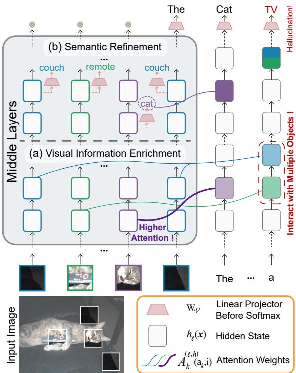  
Figure 1. Illustration of our findings: (i) visual information is primarily processed in the middle layers where (a) the model extracts the visual information and then (b) interprets the semantics embedded in image tokens; (ii) for real tokens like “cat”, the attention weights over image tokens are generally higher than hallucinated ones like “TV” in (a); (iii) the model may combine the visual features extracted from multiple objects to produce hallucinations.

Despite generating coherent textual responses, these models often exhibit undesirable object hallucinations – producing objects that do not exist in the visual input.

Although various approaches, such as visual instruction fine-tuning [14, 20, 26, 46], the integration of external expert models [5, 43, 45, 50], and contrastive decoding strategies [9, 24, 28, 42], have been proposed to address the object hallucination issue in LVLMs, the underlying mechanisms driving these hallucinations remain poorly understood. A few studies have preliminarily explored the causes of object hallucination, identifying the language bias as the primary factor, with examples including the “anchor pattern” [19] and “text inertia” [28]. In essence, these studies found that LVLMs tend to prioritize internal textual knowledge over external visual information as more tokens are generated. However, these studies have overlooked the devils in the visual parts – while intuitively, improper processing of visual information within the LVLMs could contribute more to the emergence of object hallucinations.

In this paper, we delve into how LVLMs process visual information from image tokens and how this affects the generation of object hallucinations. Building on the three-stage mechanism identified in LLMs for retrieving factual knowledge [12], we examine whether LVLMs exhibit similar distinct stages during inference and, if so, which stage is critical for processing visual information. We propose a simple score called Visual Attention Ratio (VAR) to examine the distribution of visual attention across layers, revealing that the middle layers play a crucial role in processing visual information. To study how the model processes visual information in these middle layers, we leverage the logit lens [29] method to decode the hidden states of image tokens into LVLMs’ vocabulary, identifying two crucial stages as illustrated in Fig. 1: a visual information enrichment stage propagates visual information to the object token, and a semantic refinement stage interprets the encoded visual information through text.

Secondly, focusing on these middle layers, we observe that the hallucinated tokens often exhibit (1) less active attention patterns, and (2) inconsistent attentions across different heads during visual information enrichment stage, compared to real ones. To quantify these observations, we first introduce a metric based on VAR, and confirm that real object tokens tend to assign higher attention weights over image tokens during visual information enrichment than hallucinated ones, illustrated in Fig. 1. Relying on our finding, we utilize the metric in this stage to detect hallucinated object tokens, achieving AUROC and mAP up to 74% and 88% on LLaVA-1.5-7B [27]. Second, given the various attention heads used in the Multi-Heads Self-Attention (MHSA) mechanism [40] for information aggregation, we explore the head behavior by visualizing the attention heatmaps over the input image. As illustrated in Fig. 1, we find that the heads interact with inconsistent objects during visual information enrichment when generating hallucinations.

Our empirical findings provide valuable insights into the way object hallucinations are generated, intuitively described as follows (Fig. 1): In visual information enrichment, the model’s ambiguous interactions with multiple objects result in limited and mixed visual information being propagated to the object token. Subsequently, in semantic refinement, this imprecise visual information leads the model to mistakenly associate semantic information from different objects, ultimately causing hallucinations.

Inspired by our findings, we propose a simple method to adjust the visual information process in the middle layers by integrating attention information from various heads during inference. Extensive experiments on three mainstream LVLMs show significant hallucination mitigation compared to the original models, with average reductions in CHAIRI and CHAIRS up to 6.3 and 24.1 points, respectively, while preserving detail in descriptions.

## 2. Related Work

Large Vision-Language Models. The recent integration of advanced open-source LLMs, like Llama [38, 39] and Vicuna [6], has greatly expanded the capabilities of LVLMs, enabling them to perform more complex vision-language tasks. Typically, the architecture of recent LVLMs incorporates three key components: a vision branch, such as CLIP [33] and EVA [8], to encode image inputs, a modality connector to transform image features into image embeddings aligning with text modality, and a pretrained language model to process image and prompt embeddings to generate responses. LLaVA-1.5 [27] employs an MLP to map the output of the vision branch into 576 image embeddings. Similarly, Shikra [4] utilizes one linear layer to align image features. While MiniGPT-4 [54] adopts a learnable querying transformer to establish vision-language connections, with just 32 image tokens as LVLM input. Despite their impressive capabilities, the above LVLMs suffer from severe object hallucinations. In this paper, we focus on interpreting, detecting, and mitigating their hallucinations.

Object Hallucination in LVLMs. Object hallucination [48, 52] is a prevalent and critical issue in current LVLMs where the model erroneously generates descriptions of non-existent objects in images, posing significant risks in high-stakes fields such as medical imaging [18, 23], sequential recommendation systems [15, 35], and autonomous driving [7]. Previous studies to mitigate this issue have primarily focused on visual instruction finetuning [14, 20, 26, 46, 53], incorporating external expert models [5, 43, 45, 50], and improving decoding strategies [9, 19, 24, 28, 42]. Despite numerous efforts, our understanding of the underlying mechanism driving these errors remains limited. Recent studies like OPERA [19] have pointed specific “anchor patterns” in text tokens that always align with the onset of hallucinated contents, and PAI [28] has identified “text inertia” as another contributing factor, as LVLMs reproduce identical hallucinated descriptions when solely input part of historical generated text. Contrary to these perspectives that focus on language bias, we investigate the causes of object hallucinations from the view of visual information processing through the lens of attention. Interpretability in Foundation Models. In the field of NLP, numerous studies have analyzed LLMs to explore the internal model knowledge and understand model behavior in specific settings from the perspectives of attention maps [3, 47], neural activation patterns [17], and intermediate hidden states [13, 36]. The logit lens [29], which transforms the hidden states at each layer into the vocabulary space using the model’s own linear projector before softmax, offers insightful observations into the next token prediction process [11, 16] in LLMs. Our work adapts the logit lens method to analyze hidden states of image tokens, enabling us to interpret the LVLMs’ process of understanding the visual information via textual vocabulary. Few studies explore the internal mechanisms of LVLMs [1, 2, 10], notable efforts include [30], which extends an unimodal causal tracing tool for studying neural mechanisms in BLIP’s image-conditioned text generation, and [31], which introduces a dictionary learning-based framework to extract multi-modal concepts for interpreting intermediate representations. Compared to prior works, our study leverages the internal signals from attention weights to uncover the generation of hallucinated objects.

## 3. Understanding Object Hallucinations

In this section, we start by introducing the generation process of LVLMs and the analytical tools, including visual attention ratio and logit lens. We then conduct case studies focusing on three key aspects: the processing of visual information, the attention patterns of object tokens, and the behavior of heads during object token generation.

## 3.1. Preliminary

Notation. The input to LVLMs is initialized with a sequence of d-dimensional image tokens $\{ \mathbf { v } _ { 1 } , . . . , \mathbf { v } _ { n } \}$ and instruction text (prompt) tokens $\{ \mathbf { t } _ { 1 } , . . . , \mathbf { t } _ { m } \}$ Typically structured as a Transformer decoder [40], the LVLM outputs responses in an autoregressive manner: at time step k, the model processes the initial input tokens $\left\{ \mathbf { v } _ { 1 } , . . . , \mathbf { v } _ { n } , \mathbf { t } _ { 1 } , . . . , \mathbf { t } _ { m } \right\}$ , followed by the sequence of $k { - } 1$ previously generated tokens $\left\{ \mathbf { y } _ { 1 } , . . . , \mathbf { y } _ { k - 1 } \right\}$ , to predict the next token $\mathbf { y } _ { k }$ . Let L denote the number of Transformer layers, each with H heads. At layer $\ell \in [ L ]$ , we denote the attention weights in head $h \in [ H ]$ as $\mathbf { A } _ { k } ^ { ( \ell , h ) } \in \mathbb { R } ^ { a _ { k } \times a _ { k } }$ , where $a _ { k } { = } n { + } m { + } k { - } 1$ . Additionally, we define $\mathbf { v } _ { i } ^ { \ell }$ and $\mathbf { y } _ { k - 1 } ^ { \ell }$ as the hidden states for the image token $\mathbf { v } _ { i }$ and generated token $\mathbf { y } _ { k - 1 }$ at layer ℓ, respectively. The real and hallucinated object tokens are noted as $\mathbf { y } _ { \mathsf { r } }$ and $\mathbf { y } _ { \mathsf { h } }$ , respectively.

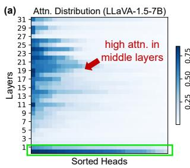

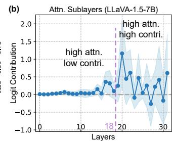  
Figure 2. (a) Distribution of visual attention ratio for real object tokens across heads and layers in LLaVA-1.5-7B, sorted rowwise by attention ratios. Note that the high attention in the 0- th layer (bottom row, green rectangle) is not consistent across all LVLMs, as Shikra and MiniGPT-4 models fail to exhibit this pattern, see Appendix C.1. (b) The logit contribution of attention sublayers to real token prediction. We find the middle layers continuously assign higher attention weights to image tokens and exhibit two different contribution patterns to the correct prediction.

Visual Attention Ratio. For the k-th token $\mathbf { y } _ { k }$ , we define the Visual Attention Ratio (VAR) in each head h at layer ℓ:

$$
\operatorname { V A R } ^ { ( \ell , h ) } ( \mathbf { y } _ { k } ) \triangleq \sum _ { i = 1 } ^ { n } \mathbf { A } _ { k } ^ { ( \ell , h ) } ( a _ { k } , i ) ,\tag{1}
$$

where $\mathbf { A } _ { k } ^ { ( \ell , h ) } ( a _ { k } , i )$ represents the attention weights of the newly generated token $\mathbf { y } _ { k }$ assigned to the image token $\mathbf { v } _ { i }$ VAR quantifies the extent of the token $\mathbf { y } _ { k } ^ { } \mathbf { \widetilde { s } }$ interaction with visual information: a higher VAR score indicating a greater contributionfrom image tokens during $\mathbf { y } _ { k }$ ’s generation.

Logit Lens. We utilize this technique to investigate how the model interprets the visual hidden state $\mathbf { v } _ { i } ^ { \ell }$ during inference via text. We denote the linear projector before softmax as $\mathbf { W } _ { \gamma \in \mathbb { R } } | \mathcal { V } | \times d$ , which is applied to $\mathbf { y } _ { k - 1 } ^ { L }$ to predict the probability of next token over the vocabulary V. Then, the logit lens transforms the hidden state $\mathbf { v } _ { i } ^ { \ell }$ of the image tokens to the prediction probability distribution over the vocabulary by the linear projector $\mathbf { W } _ { \mathcal { V } }$

$$
\mathbf { p } ( \mathcal { V } | \mathbf { v } _ { i } ^ { \ell } ) = \operatorname { s o f t m a x } ( \mathbf { W } _ { \mathcal { V } } \cdot \mathbf { v } _ { i } ^ { \ell } ) \in \mathbb { R } ^ { | \mathcal { V } | } ,\tag{2}
$$

where $\mathbf { p } _ { j } ( \gamma | \mathbf { v } _ { i } ^ { \ell } )$ corresponds to the j-th text token in the vocabulary. To explain the processed image token, the text token with the highest probability is considered as the model’s interpretation of the hidden state $\mathbf { v } _ { i } ^ { \ell }$ at layer ℓ.

## 3.2. Experimental Setup for Case Study

We conduct case studies with a randomly selected subset of 2,000 images from COCO 2014 validation set [25]. These images represent diverse scenes and activities across 80 common object categories, each paired with multiple object annotations. The 7B version of LLaVA-1.5 serves as the main focus for the subsequent analysis. In Appendix C.1, we further repeat our case studies on other LVLMs, including Shikra and MiniGPT-4, and observe consistent findings.

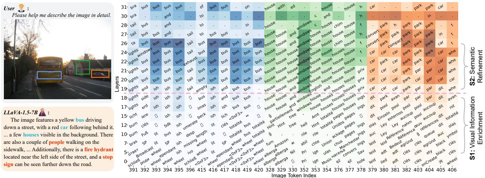  
Figure 3. Case study of image hidden state interpretation in LLaVA-1.5-7B via logit lens. The heatmap illustrates the retrieved texts of the image hidden states across layers in the three distinct regions, differentiated by color. Our findings reveal that the model’s semantic comprehension of image tokens emerges in the later middle layers (19-26) while remaining largely absent in earlier layers. The real and hallucinated object tokens are presented in blue and red in the description, respectively.

To investigate the internal patterns in generating real and hallucinated object tokens, we use the model with greedy search to generate captions for the selected images, prompted by “Please help me describe the image in detail.”. Real and hallucinated object tokens are then identified using ground truth annotations as a reference. For multi-token objects, only the first token is considered. As a result, we obtained 1,842 hallucinated tokens and 4,397 real tokens.

## 3.3. Finding 1: Middle Layers Matter for Visual Information Interaction

To assess the contribution of visual information to token generations, we compute the VAR score (Eq. (1)) for real object tokens $\mathbf { y } _ { \mathsf { r } }$ across all layers $\ell \in [ L ]$ and heads $h \in [ H ]$ We calculate the mean of $\bar { \mathbf { V } } \mathbf { A } \mathbf { R } ^ { ( \ell , h ) } ( \bar { \mathbf { y } } _ { r } )$ for all real object tokens in our case dataset, with the results depicted in Fig. 2 (a). The visualization shows that the middle layers, i.e., 5-26 layers, continuously exhibit high attention weights to the image tokens, indicating that visual information interaction primarily occurs in the middle layers.

We further analyze how the model processes visual information by examining signals from the MHSA sublayers. Using the logit lens, we quantify the contribution of the MHSA sublayers to real token prediction as ${ \bf p } _ { \circ } ( \nu | { \bf a } _ { \mathrm { r } } ^ { \ell } )$ where $\mathbf { a } _ { \mathsf { r } } ^ { \ell }$ is the output of the MHSA sublayer at layer $\ell ,$ and o denotes the index of the real object token $\mathbf { y } _ { \mathsf { r } }$ in the vocabulary. Fig. 2 (b) reveals two patterns in the contributions from the MHSA sublayers: lower in 5-18 layers and higher in 19-26 layers, reflecting varied use of visual information.

To better understand these two patterns, we use the logit lens to map the hidden states of image token $\mathbf { v } _ { i } ^ { \ell }$ to text. Specifically, for each image token $\mathbf { v } _ { i }$ at layer ℓ, we retrieve the text token in the vocabulary with the highest probability, $i . e . , \mathrm { a r g m a x } _ { 1 \le j \le | \mathcal { V } | } \{ \mathbf { p } _ { j } ( \mathcal { V } | \mathbf { v } _ { i } ^ { \ell } ) \}$ . A case is shown in Fig. 3, revealing two stages in the middle layers with different visual information usage:

• Stage 1: Visual Information Enrichment. The first stage, in layers 5–18, shows that retrieved text tokens are less related to the corresponding image patches, suggesting the model is unable to interpret visual information. This misalignment might explain the low prediction contributions observed in Fig. 2 (b). Meanwhile, these layers continue to show high VAR scores, indicating that the object tokens are accumulating visual information through self-attention. In Secs. 3.4 and 3.5, we show that such attention serves as a key indicator to identify hallucinations.

• Stage 2: Semantic Refinement. The second stage, in layers 19–26, shows that the retrieved text tokens are semantically consistent with the image patches, suggesting the model is able to interpret and utilize the visual information encoded in the image tokens. Given the high VAR during this stage, we term it as semantic refinement where the model actively interacts with the semantic information of image tokens to reason object token prediction.

## 3.4. Finding 2: Inactive Visual Attention in Middle Layers Implies Hallucination

Given that visual information is primarily processed in the middle layers, a natural question arises: does the model display unusual attention patterns in these layers when generating hallucinated object tokens? Fig. 4 presents the VAR distribution for real object tokens (‘bus’ and ‘car’) and hallucinated ones (‘people’ and ‘fire hydrant’) from the case of Fig. 3. We observe that the hallucinated object tokens demonstrate an inactive attention pattern during the visual information enrichment stage (5-18 layers) compared to the real ones. We conjecture that such pattern weakens the interaction between the object token and image tokens in this stage, limiting the propagation of visual information and potentially leading to hallucinations. To quantify this observation, we introduce a metric, Summed Visual Attention Ratio (SVAR), calculated by averaging VAR scores over all heads and summing across selected layers $[ \ell _ { s } , \ell _ { e } ]$ . Specifically, for a real object token $\mathbf { y } _ { \mathsf { r } }$ in $[ \ell _ { 5 } , \ell _ { 1 8 } ]$ , we compute:

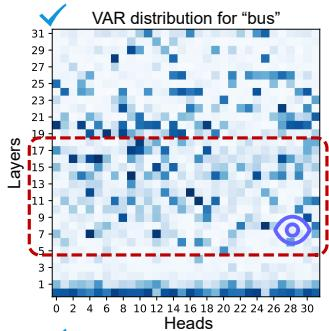

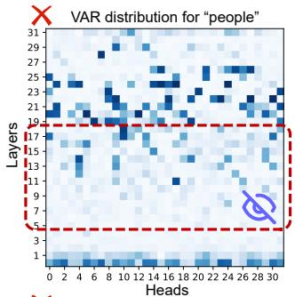

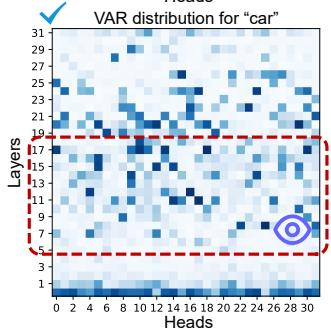

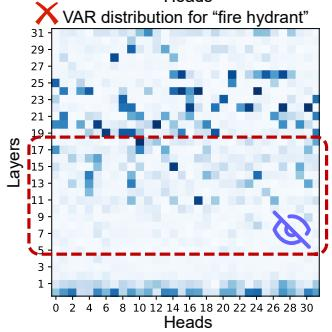  
Figure 4. Case study of the visual attention ratio distribution over heads and layers in LLaVA-1.5-7B. Left: real objects; Right: hallucinated objects. We find that the hallucinated object tokens exhibit inactive attention patterns during visual information enrichment compared to the real ones.

$$
\mathrm { S V A R } _ { 5 - 1 8 } ( \mathbf { y } _ { \mathsf { r } } ) \triangleq \frac { 1 } { H } \sum _ { \ell = 5 } ^ { 1 8 } \sum _ { h = 1 } ^ { H } \mathrm { V A R } ^ { ( \ell , h ) } ( \mathbf { y } _ { \mathsf { r } } ) .\tag{3}
$$

We conduct a statistical experiment on the ${ \bf S V A R } _ { 5 - 1 8 }$ metric for both real and hallucinated tokens. The results, depicted in Fig. 5 (a), and the associated statistical test detailed in Appendix C.2, indicate a salient difference: the model assigns significantly higher attention weights to image tokens when generating real object tokens during visual information enrichment compared to hallucinated ones. Fig. 5 (b) shows a similar trend in LLaVA-1.5-13B.

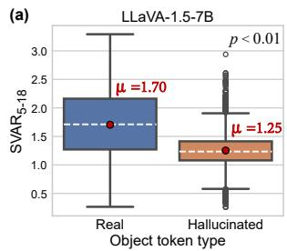

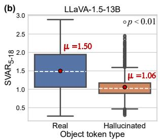  
Figure 5. $\mathrm { S V A R _ { 5 - 1 8 } }$ score distributions across object token types for the 7B (a) and 13B (b) versions of LLaVA-1.5.

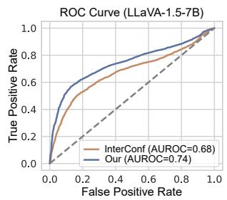

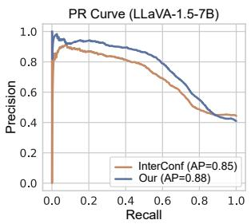  
Figure 6. Object hallucination detection curves for LLaVA-1.5- 7B. We show the ROC and Precision-Recall curves of ${ \mathrm { S V A R } } _ { 5 - 1 8 }$ metric for object hallucination detection on the case study dataset.

## 3.4.1 Application: Object Hallucination Detection

Building upon our Finding 2, we apply the $\mathrm { S V A R } _ { 5 - 1 8 }$ metric to detect object hallucinations. We assess the efficacy of $\mathrm { S V A R _ { 5 - 1 8 } }$ in reflecting object hallucination using our case dataset, where a positive sample is a real object token and a negative sample is a hallucinated one. For comparison, we use the internal confidence metric recently proposed in [21] as a baseline. The internal confidence uses the maximum probability of the object token within all image hidden states $\{ \mathbf v _ { i } ^ { \ell } : \dot { i } \in [ n ] , \ell \in [ \bar { L } ] \}$ , mapped by the logit lens for detection. The qualitative results are presented in Fig. 6 and the results for LLaVA-1.5-13B are shown in Appendix C.1. Compared to internal confidence, using the simple $\mathrm { S V A R } _ { 5 - 1 8 }$ metric improves the AUROC by 8.82% and the AP by 3.53%, verifying the utility of our metric. This further suggests that the middle layers provide crucial indicator information for object hallucination.

Beyond the hand-crafted $\mathrm { S V A R } _ { 5 - 1 8 }$ measure, we explore the potential of middle layers to indicate hallucinations by training a simple model to derive metrics directly from raw visual attention states.

Experimental setting. We train a two-layer MLP by inputting the concatenated VAR scores across all heads in the layer range of interest $[ \ell _ { s } , \ell _ { e } ]$ to classify the real and hallucinated object tokens. Specifically, the input vector $\mathbf { x } ( \mathbf { y } _ { \mathsf { r } } )$ for the real token $\mathbf { y } _ { \mathsf { r } }$ can be written as:

$$
\mathbf { x } ( \mathbf { y } _ { r } ) = [ \mathrm { V A R } ^ { ( \ell _ { s } , 1 ) } , \mathrm { V A R } ^ { ( \ell _ { s } , 2 ) } , \dots , \mathrm { V A R } ^ { ( \ell _ { e } , H ) } ] ^ { \top } .\tag{4}
$$

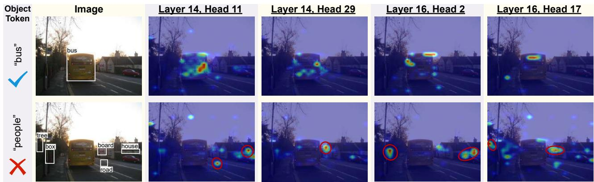  
Figure 7. Visualization of attention maps over image for ‘bus’ (real) and ‘people’ (hallucinated) object tokens in heads (ℓ, h). We find tha the heads tend to interact with multiple objects when generating hallucinated object tokens. More examples can be found in Appendix C.4.

We split the case dataset into training and test sets in the ratio of 8:2, and train the MLP with cross-entropy loss. The model performance is evaluated using accuracy, AUROC, and recall metrics. Training details are in Appendix B.2.

Results. We experiment with four layer ranges in LLaVA-1.5-7B: [0, 4], [5, 18], [19, 26], and [27, 31], as shown in Tab. 1. We can see using the layers of visual information enrichment (5-18) achieves the best performance among other ranges, validating the effectiveness of our Finding 2. We observe that other layers also encode hallucinationrelated information which can be learned to detect hallucinations. However, compared to the explicit pattern in 5-18 layers, the implicit patterns contained in other ranges require computation costs for feature learning.

## 3.5. Finding 3: Attention Heads Interact with Multiple Objects Incurring Object Hallucination

Considering the MHSA mechanism incorporates various attention heads to aggregate information, we analyze heatmaps over the image for both real and hallucinated object tokens (‘bus’ vs ‘people’) to investigate the head behavior during visual information enrichment. A case is shown in Fig. 7 and more examples can be found in Appendix C.4. We can see that each head focuses on distinct local details, yet the attention distribution for the real token consistently aligns with the spatial extent of the corresponding object. In contrast, for the hallucinated token, the heads interact with inconsistent objects in the image during this stage. We speculate that such unstable head behavior encodes mixed information from multiple objects into the object token, potentially leading to hallucinations.

## 4. Object Hallucination Mitigation

## 4.1. Heads Guided Attention Intervention

Inspired by the insights from Sec. 3 that improper processing of visual information during inference can lead to object hallucinations, we aim to correct this process to alleviate object hallucination. Specifically, we adjust the attention weights assigned to image tokens, i.e., $\{ \mathbf { A } _ { k } ^ { ( \ell , h ) } ( a _ { k } , i ) \} _ { i = 1 } ^ { n } ,$ in each head at the middle layers during inference for intervention. To modify the attention weights in time step $k ,$ we extract the attention score matrix $\mathbf { S } _ { k } ^ { ( \overline { { \ell } } , h ) }$ before softmax operation:

<table><tr><td>Layers</td><td>0-4</td><td>5-18</td><td>19-26</td><td>27-31</td><td>0-31</td></tr><tr><td>Accuracy</td><td>82.61</td><td>84.46</td><td>81.49</td><td>77.72</td><td>84.46</td></tr><tr><td>AUROC</td><td>89.57</td><td>90.19</td><td>87.34</td><td>84.30</td><td>90.28</td></tr><tr><td>Recall</td><td>66.22</td><td>72.34</td><td>68.88</td><td>63.56</td><td>71.28</td></tr></table>

Table 1. Object hallucination detection results (%) of different layer ranges of interest on LLaVA-1.5-7B.

$$
{ \bf S } _ { k } ^ { ( \ell , h ) } = \left( \frac { { \bf Q } _ { \ell , h } { \bf K } _ { \ell , h } ^ { \top } } { \sqrt { d _ { k } } } \right) _ { k } ,\tag{5}
$$

where $\mathbf { Q } _ { \ell , h }$ and $\mathbf { K } _ { \ell , h } { \in } \mathbb { R } ^ { a _ { k } \times d _ { k } }$ represent the query and key matrices of dimension $d _ { k }$ , respectively.

Guided by the attention pattern difference in Finding 2, we amplify the original attention scores in the layers of visual information enrichment by adding positive values to enhance visual information interaction. Furthermore, leveraging the head behavior observed in Finding 3, we compute these positive values by averaging the absolute attention scores across all heads, where only the consistent regions interacted by different heads receive large enhancement. By integrating the attention information from various heads, we can find a more faithful and object-related direction for attention shift to reduce hallucinations. Formally, for each image token $i \in [ n ]$ across all heads $h \in [ H ]$ in layer $\ell \in [ \ell _ { s } , \ell _ { e } ]$ , we adjust the visual attention scores by:

$$
\mathbf { S } _ { k } ^ { ( \ell , h ) } ( a _ { k } , i ) = \mathbf { S } _ { k } ^ { ( \ell , h ) } ( a _ { k } , i ) + \alpha \frac { 1 } { H } \sum _ { h = 1 } ^ { H } | \mathbf { S } _ { k } ^ { ( \ell , h ) } ( a _ { k } , i ) | ,\tag{6}
$$

<table><tr><td rowspan="2">Method</td><td colspan="3">LLaVA-1.5-7B</td><td colspan="3">LLaVA-1.5-13B</td><td colspan="3">Shikra-7B</td><td colspan="3">MiniGPT-4-7B</td><td colspan="2">Avg.</td></tr><tr><td> $C _ { S } \downarrow$ </td><td> $C _ { I \ \downarrow }$ </td><td>F1↑</td><td> $C _ { S } \downarrow$ </td><td> $C _ { I \ \downarrow }$ </td><td>F1↑</td><td> $C _ { S } \downarrow$ </td><td> $C _ { I \ \downarrow }$ </td><td>F1↑</td><td> $C _ { S } \downarrow$ </td><td> $C _ { I \downarrow }$ </td><td>F1↑</td><td> $C _ { S } \downarrow$ </td><td> $C _ { I \downarrow }$ </td></tr><tr><td colspan="10">Decoding Strategy</td><td colspan="3"></td><td colspan="3"></td></tr><tr><td>Greedy</td><td>53.0</td><td>15.6</td><td>76.7</td><td>49.8</td><td>14.6</td><td>78.2</td><td>57.6</td><td>15.7</td><td>75.3</td><td>31.8</td><td>12.0</td><td>71.1</td><td>48.1</td><td>14.5</td></tr><tr><td>Beam</td><td>55.6</td><td>15.4</td><td>77.5</td><td>50.4</td><td>13.8</td><td>79.0</td><td>59.0</td><td>16.3</td><td>74.6</td><td>29.2</td><td>9.9</td><td>71.2</td><td>48.6</td><td>13.9</td></tr><tr><td colspan="10">OPERA 45.6</td><td colspan="3">9.6</td><td colspan="3">38.8</td></tr><tr><td></td><td></td><td>13.1</td><td>79.1</td><td>42.6</td><td>13.2</td><td>77.8</td><td>41.4</td><td>13.7</td><td>73.5</td><td>25.4</td><td></td><td>71.2</td><td colspan="3"></td></tr><tr><td colspan="10">Contrastive Decoding</td><td colspan="7"></td></tr><tr><td>VCD†</td><td>58.6</td><td>18.2</td><td>72.8</td><td>53.6</td><td>15.3</td><td>75.8</td><td>56.4</td><td>15.5</td><td>75.2</td><td>41.4</td><td>14.1</td><td>68.2</td><td>52.5</td><td></td><td>15.8</td></tr><tr><td>PAI†</td><td>24.2</td><td>7.1</td><td>75.2</td><td>33.0</td><td>9.2</td><td>77.8</td><td>38.6</td><td>10.1</td><td>76.2</td><td>23.2</td><td>8.2</td><td>71.4</td><td></td><td>29.8</td><td>8.7</td></tr><tr><td>Ours† ∆%</td><td>25.0</td><td>6.7</td><td>76.1</td><td>25.8 ↓21.8%</td><td>8.8 ↓4.3%</td><td>77.3</td><td>23.8</td><td>9.4</td><td>72.7</td><td>21.4</td><td></td><td>8.0</td><td>70.8</td><td>24.0</td><td>8.2 ↓5.7%</td></tr></table>

Table 2. CHAIR hallucination evaluation and F1 results on three LVLMs with max new token set to 512. † denotes using the greedy decoding strategy. Our method outperforms other baselines and also preserves the richness of the descriptions. ∆% denotes the relative performance improvement with respect to the second-best method.

where the $[ \ell _ { s } , \ell _ { e } ]$ denotes the range of visual information enrichment, and the parameter α is defined as a balance factor to control the intervention strength.

## 4.2. Experimental Setup and Results

Models. We conduct experiments on three representative LVLMs to evaluate the effectiveness and generalization of our method, including the LLaVA-1.5 [27], Shikra [4], and MiniGPT-4 [54]. In our experiments, we use the 7B and 13B versions of LLaVA-1.5 to study the scale effect, while other LVLMs are 7B models.

Baselines. We adopt two commonly used decoding strategies and three mainstream hallucination mitigation approaches as the baseline methods, including greedy decoding, beam search decoding [37], OPERA [19], VCD [24], and PAI [28]. Greedy decoding selects the token with the highest probability over the vocabulary as the predicted next token. Beam search decoding maintains multiple beams and selects the top tokens with the highest cumulative probabilities at the end of generation. Improved on beam search, OPERA introduces an overtrust penalty term on the attention weights during inference with a rollback strategy to mitigate hallucinations. Different from the above three decoding approaches, VCD and PAI can be categorized as contrastive decoding methods. Specifically, VCD subtracts the output logits of the distorted visual input from the original output logits to reduce the statistical priors. In addition to using contrastive decoding, PAI further manipulates the attention matrix to overcome language bias. In our experiments, we use the default parameters of these baselines and unify $N _ { \mathrm { b e a m } } { = } 5$ for the beam search decoding and OPERA. Benchmark and Metrics. Following [19], we conduct experiments on 500 random images from the COCO 2014 validation set. To evaluate the degree of object hallucinations in the image captioning task, we adopt the CHAIR [34] criteria which computes the proportion of all objects mentioned in the caption that are not present in the ground-truth annotations. CHAIR provides two main metrics, including $\mathrm { C H A I R } _ { I } \left( C _ { I } \right)$ and $\mathbf { C H A I R } _ { S } \mathbf { \left( \boldsymbol { C } _ { S } \right) }$ that assess instance-level and sentence-level hallucinations, respectively:

$$
\begin{array} { r } { C _ { I } = \frac { \left| \{ \mathrm { h a l l u c i n a t e d o b j e c t s } \} \right| } { \left| \{ \mathrm { a l l m e n t i o n e d o b j e c t s } \} \right| } , C _ { S } = \frac { \left| \{ \mathrm { c a p t i o n s w / h a l l u c i n a t e d o b j e c t s } \} \right| } { \left| \{ \mathrm { a l l c a p t i o n s j } \right| } } ,  \end{array}
$$

where lower values indicate fewer hallucinations. Following [28], we also adopt the F1 score to assess the richness and accuracy of the generated descriptions.

Implementation details. Our method contains two parameters: the visual information enrichment range $[ \ell _ { s } , \ell _ { e } ]$ and the balance factor α in Eq. (6). Utilizing the VAR feature and logit lens described in Sec. 3.1, we can easily establish suitable ranges for any other LVLMs. In our experiment, we set the ranges as [5, 18] for both versions of LLaVA-1.5, [3, 13] for Shikra, and [3, 14] for MiniGPT-4. We set α to 0.5 for LLaVA-1.5, MiniGPT-4, and 0.55 for Shikra. We implement our method with greedy decoding as a baseline. Results. Tab. 2 presents the experimental results for the selected LVLMs with max new tokens of 512. From the Tab. 2, our approach outperforms the three decoding strategies in reducing hallucinations and achieves an average reduction of 19.5% in $C _ { S }$ and 5.7% in $C _ { I } ,$ compared to the second-best baseline. Compared to VCD, our method not only achieves superior hallucination mitigation performance but also better preserves the richness of the descriptions. Compared to PAI which requires the cost of once additional forward process for contrastive decoding, our approach achieves comparable or superior performance by only adjusting attention weights during inference, validating the efficacy of our method. Moreover, the consistent reduction of hallucinations across four different LVLMs confirms the generalizability of our findings. To evaluate the impact of generated token lengths, we conduct experiments on LLaVA-1.5-7B by varying the max new token in {64, 128, 256}. The results, reported in Tab. 3, show that our method consistently reduces hallucinations across different token lengths and achieves the best performance on average, demonstrating its robustness. We provide qualitative results in Appendix C.7.

<table><tr><td rowspan="2">Method</td><td colspan="3">max new token 64</td><td colspan="3">max new token 128</td><td colspan="3">max new token 256</td><td colspan="2">Avg.</td></tr><tr><td> $\overline { { C _ { S } \downarrow ~ C _ { I } \downarrow } }$ </td><td></td><td>F1↑</td><td> $C _ { S } \downarrow$ </td><td> $C _ { I } \downarrow$ </td><td>F1↑</td><td> $C _ { S } \downarrow$ </td><td> $C _ { I } \downarrow$ </td><td>F1↑</td><td> $\begin{array} { r l } { C _ { S } \downarrow } & { { } C _ { I } \downarrow } \end{array}$ </td><td></td></tr><tr><td colspan="10">Decoding Strategy</td></tr><tr><td>Greedy</td><td>23.8</td><td>8.0</td><td>74.7</td><td>52.4</td><td>15.5</td><td>76.7</td><td>53.0</td><td>15.6</td><td>76.7</td><td>43.1</td><td>13.0</td></tr><tr><td>Beam</td><td>17.6</td><td>6.0</td><td>75.1</td><td>54.4</td><td>14.8</td><td>77.6</td><td>55.6</td><td>15.4</td><td>77.5</td><td>42.5</td><td>12.1</td></tr><tr><td>OPERA</td><td>19.0</td><td>6.3</td><td>74.4</td><td>44.2</td><td>12.9</td><td>78.8</td><td>45.6</td><td>13.1</td><td>79.1</td><td>36.3</td><td>10.8</td></tr><tr><td colspan="10">Contrastive Decoding</td></tr><tr><td>VCD†</td><td>26.0</td><td>9.3</td><td>73.3</td><td>56.8</td><td>16.9</td><td>74.5</td><td>58.6</td><td>18.2</td><td>72.8</td><td>47.1</td><td>14.8</td></tr><tr><td>PAI†</td><td>19.8</td><td>6.2</td><td>74.0</td><td>24.2</td><td>7.3</td><td>75.2</td><td>24.2</td><td>7.2</td><td>75.2</td><td>22.7</td><td>6.9</td></tr><tr><td>Ours†</td><td>18.2</td><td>5.4</td><td>73.9</td><td>24.8</td><td>7.1</td><td>76.0</td><td>25.0</td><td>7.1</td><td>76.1</td><td>22.7</td><td>6.5</td></tr></table>

Table 3. CHAIR hallucination evaluation and F1 results on LLaVA-1.5-7B with varying max new token in {64, 128, 256}. † denotes using the greedy decoding strategy.
<table><tr><td>Layers</td><td>0-4</td><td>5-18</td><td>19-26</td><td>27-31</td><td>Greedy</td></tr><tr><td> $C _ { S }$  →</td><td>31.0</td><td>25.0</td><td>53.4</td><td>53.4</td><td>53.0</td></tr><tr><td> $C _ { I } \downarrow$ </td><td>10.4</td><td>6.7</td><td>14.3</td><td>15.7</td><td>15.6</td></tr><tr><td>F1↑</td><td>77.1</td><td>76.1</td><td>77.5</td><td>77.2</td><td>76.7</td></tr></table>

Table 4. CHAIR hallucination evaluation and F1 score among four layer ranges on LLaVA-1.5-7B with max new token set to 512.

## 5. Ablations and Discussions

Layers of attention intervention. Motivated by the empirical observation of implicit hallucination patterns across layers beyond the 5-18 range in Sec. 3.4.1, we investigate whether interventions in these layers can also mitigate object hallucinations. We apply our approach (Eq. (6)) to the layer ranges [0, 4], [19, 26], and [27, 31] in LLaVA-1.5-7B, and the results are reported in Tab. 4. We observe that the 5-18 layer range largely outperforms the other ranges while using some ranges (19-26 and 27-31) even enhanced hallucinations instead. The result suggests that explicit patterns in visual information enrichment are more effective than implicit patterns, facilitating more effective hallucination mitigation through simple attention intervention.

Different attention intervention strategies. To validate the efficacy of our method in adjusting attention weights to reduce object hallucinations, we compare it with the inference intervention component proposed in PAI [28]. The inference intervention component roughly excites attention weights by computing a weighted sum of the attention scores and their absolute values across individual heads. We apply this approach to the same layer ranges in ours on LLaVA-1.5-7B, Shikra, and MiniGPT-4. Tab. 5 suggests that our attention intervention method surpasses that of PAI, as our method integrates attention information from various heads to shift attention toward a more truthful direction.

Balance factor α sensitivity. To examine the influence of α on intervention efficacy, we vary its value in the range of $\{ 0 . 3 , 0 . 4 , 0 . 5 , 0 . 6 , 0 . 7 \}$ and the results of CHAIR metrics and F1 score for the 7B version of both LLaVA-1.5 and MiniGPT-4 are shown in Fig. 8. We find that a lower α limits hallucination mitigation effectiveness, whereas a higher α compromises the richness of descriptions. These results indicate that an appropriate α value (e.g., 0.5 for both selected LVLMs) balances the reduction of hallucinations with the maintenance of detailed visual descriptions.

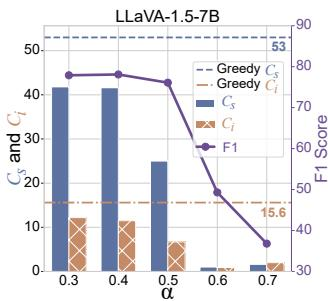

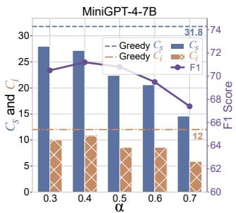

Figure 8. Parameter sensitivity of α with CHAIR metrics.
<table><tr><td rowspan="2">Method</td><td colspan="2">LLaVA-1.5-7B</td><td colspan="2">Shikra-7B</td><td colspan="2">MiniGPT-4-7B</td></tr><tr><td> $C _ { S } \downarrow$ </td><td> $C _ { I \downarrow }$ </td><td> $C _ { S } \downarrow$ </td><td> $C _ { I } \downarrow$ </td><td> $C _ { S } \downarrow$ </td><td> $C _ { I \downarrow }$ </td></tr><tr><td>PAI*</td><td>26.6</td><td>8.1</td><td>45.8</td><td>13.6</td><td>30.2</td><td>9.5</td></tr><tr><td>Ours</td><td>25.0</td><td>6.7</td><td>23.8</td><td>9.4</td><td>21.4</td><td>8.0</td></tr></table>

Table 5. CHAIR hallucination evaluation and F1 results on three LVLMs. ⋆ denotes only using the inference intervention component in the same layer range as ours. Greedy decoding is adopted.

## 6. Conclusion and Insights

We introduce a new perspective, visual information processing, to investigate the underlying mechanisms driving object hallucination. Analyzing through the lens of attention, we identify three key findings and discover a simple yet effective method for reducing hallucinations at inference time. Our study deepens the understanding of how hallucinations are produced in LVLMs. We conclude with three insights for future direction: 1) Based on LVLMs’ interpretation in semantic refinement stage, the image tokens may be further categorized into sub-groups, such as object tokens, color tokens, and textual tokens, enabling us to explore how the LVLMs extract different types of visual information. 2) While we focus on visual information processing, there may exist more granular, stage-wise mechanisms that could explain model behavior more precisely. 3) Instead of external interventions on LVLM outputs, such as contrastive decoding, we suggest that targeted modifications to specific internal states, like attention weights in middle layers, offer a more effective method for calibration. Our insights may aid the community in developing more trustworthy and reliable LVLMs against hallucinations.

## Acknowledgment

This work is supported by the National Science Foundation of China (62376281, 62206048), the Natural Science Foundation of Jiangsu Province (BK20220819), and the Fundamental Research Funds for the Central Universities (2242024k30035).

## References

[1] Jize Cao, Zhe Gan, Yu Cheng, Licheng Yu, Yen-Chun Chen, and Jingjing Liu. Behind the scene: Revealing the secrets of pre-trained vision-and-language models. In Computer Vision – ECCV 2020, pages 565–580, 2020. 3

[2] Min Cao, Yang Bai, Ziyin Zeng, Mang Ye, and Min Zhang. An empirical study of clip for text-based person search. In Proceedings of the AAAI Conference on Artificial Intelligence, pages 465–473, 2024. 3

[3] Hila Chefer, Shir Gur, and Lior Wolf. Generic attentionmodel explainability for interpreting bi-modal and encoderdecoder transformers. In Proceedings of the IEEE/CVF International Conference on Computer Vision, pages 397–406, 2021. 3

[4] Keqin Chen, Zhao Zhang, Weili Zeng, Richong Zhang, Feng Zhu, and Rui Zhao. Shikra: Unleashing multimodal llm’s referential dialogue magic. arXiv preprint arXiv:2306.15195, 2023. 1, 2, 7

[5] Zhaorun Chen, Zhuokai Zhao, Hongyin Luo, Huaxiu Yao, Bo Li, and Jiawei Zhou. Halc: Object hallucination reduction via adaptive focal-contrast decoding. arXiv preprint arXiv:2403.00425, 2024. 2

[6] Wei-Lin Chiang, Zhuohan Li, Zi Lin, Ying Sheng, Zhanghao Wu, Hao Zhang, Lianmin Zheng, Siyuan Zhuang, Yonghao Zhuang, Joseph E Gonzalez, et al. Vicuna: An open-source chatbot impressing gpt-4 with 90%\* chatgpt quality. See https://vicuna. lmsys. org (accessed 14 April 2023), 2023. 2

[7] Can Cui, Yunsheng Ma, Xu Cao, Wenqian Ye, Yang Zhou, Kaizhao Liang, Jintai Chen, Juanwu Lu, Zichong Yang, Kuei-Da Liao, et al. A survey on multimodal large language models for autonomous driving. In Proceedings of the IEEE/CVF Winter Conference on Applications of Computer Vision, pages 958–979, 2024. 2

[8] Yuxin Fang, Wen Wang, Binhui Xie, Quan Sun, Ledell Wu, Xinggang Wang, Tiejun Huang, Xinlong Wang, and Yue Cao. Eva: Exploring the limits of masked visual representation learning at scale. In Proceedings ofthe IEEE/CVF Conference on Computer Vision and Pattern Recognition, pages 19358–19369, 2023. 2

[9] Alessandro Favero, Luca Zancato, Matthew Trager, Siddharth Choudhary, Pramuditha Perera, Alessandro Achille, Ashwin Swaminathan, and Stefano Soatto. Multi-modal hallucination control by visual information grounding. In Proceedings of the IEEE/CVF Conference on Computer Vision and Pattern Recognition, pages 14303–14312, 2024. 2

[10] Yossi Gandelsman, Alexei A. Efros, and Jacob Steinhardt. Interpreting CLIP’s image representation via text-based de-

composition. In International Conference on Learning Representations, 2024. 3

[11] Mor Geva, Avi Caciularu, Kevin Wang, and Yoav Goldberg. Transformer feed-forward layers build predictions by promoting concepts in the vocabulary space. In Proceedings of the Conference on Empirical Methods in Natural Language Processing, pages 30–45, 2022. 3

[12] Mor Geva, Jasmijn Bastings, Katja Filippova, and Amir Globerson. Dissecting recall of factual associations in autoregressive language models. In Proceedings of the Conference on Empirical Methods in Natural Language Processing, pages 12216–12235, 2023. 2

[13] Asma Ghandeharioun, Avi Caciularu, Adam Pearce, Lucas Dixon, and Mor Geva. Patchscopes: A unifying framework for inspecting hidden representations of language models. In International Conference on Machine Learning, pages 15466–15490. PMLR, 2024. 3

[14] Anisha Gunjal, Jihan Yin, and Erhan Bas. Detecting and preventing hallucinations in large vision language models. In Proceedings of the AAAI Conference on Artificial Intelli gence, pages 18135–18143, 2024. 2

[15] Wei Guo, Hao Wang, Luankang Zhang, Jin Yao Chin, Zhongzhou Liu, Kai Cheng, Qiushi Pan, Yi Quan Lee, Wanqi Xue, Tingjia Shen, et al. Scaling new frontiers: In sights into large recommendation models. arXiv preprint arXiv:2412.00714, 2024. 2

[16] Danny Halawi, Jean-Stanislas Denain, and Jacob Steinhardt. Overthinking the truth: Understanding how language models process false demonstrations. In International Conference on Learning Representations, 2024. 3

[17] Jinwen He, Yujia Gong, Zijin Lin, Yue Zhao, Kai Chen, et al. Llm factoscope: Uncovering llms’ factual discernment through measuring inner states. In Findings of the Associa tion for Computational Linguistics ACL 2024, pages 10218– 10230, 2024. 3

[18] Yuting He, Guanyu Yang, Rongjun Ge, Yang Chen, Jean-Louis Coatrieux, Boyu Wang, and Shuo Li. Geometric vi sual similarity learning in 3d medical image self-supervised pre-training. In Proceedings of the IEEE/CVF Conference on Computer Vision and Pattern Recognition, pages 9538– 9547, 2023. 2

[19] Qidong Huang, Xiaoyi Dong, Pan Zhang, Bin Wang, Con ghui He, Jiaqi Wang, Dahua Lin, Weiming Zhang, and Nenghai Yu. Opera: Alleviating hallucination in multimodal large language models via over-trust penalty and retrospection-allocation. In Proceedings of the IEEE/CVF Conference on Computer Vision and Pattern Recognition, pages 13418–13427, 2024. 2, 3, 7

[20] Chaoya Jiang, Haiyang Xu, Mengfan Dong, Jiaxing Chen, Wei Ye, Ming Yan, Qinghao Ye, Ji Zhang, Fei Huang, and Shikun Zhang. Hallucination augmented contrastive learning for multimodal large language model. In Proceedings of the IEEE/CVF Conference on Computer Vision and Pattern Recognition, pages 27036–27046, 2024. 2

[21] Nick Jiang, Anish Kachinthaya, Suzie Petryk, and Yossi Gandelsman. Interpreting and editing vision-language representations to mitigate hallucinations. arXiv preprint arXiv:2410.02762, 2024. 5

[22] Diederik P Kingma. Adam: A method for stochastic optimization. arXiv preprint arXiv:1412.6980, 2014. 1

[23] Youyong Kong, Xiaotong Zhang, Wenhan Wang, Yue Zhou, Yueying Li, and Yonggui Yuan. Multi-scale spatial-temporal attention networks for functional connectome classification. IEEE Transactions on Medical Imaging, 2024. 2

[24] Sicong Leng, Hang Zhang, Guanzheng Chen, Xin Li, Shijian Lu, Chunyan Miao, and Lidong Bing. Mitigating object hallucinations in large vision-language models through visual contrastive decoding. In Proceedings of the IEEE/CVF Conference on Computer Vision and Pattern Recognition, pages 13872–13882, 2024. 2, 7

[25] Tsung-Yi Lin, Michael Maire, Serge Belongie, James Hays, Pietro Perona, Deva Ramanan, Piotr Dollar, and C Lawrence´ Zitnick. Microsoft coco: Common objects in context. In Computer Vision–ECCV 2014: 13th European Conference, Zurich, Switzerland, September 6-12, 2014, Proceedings, Part V 13, pages 740–755. Springer, 2014. 3

[26] Fuxiao Liu, Kevin Lin, Linjie Li, Jianfeng Wang, Yaser Yacoob, and Lijuan Wang. Mitigating hallucination in large multi-modal models via robust instruction tuning. In International Conference on Learning Representations, 2024. 2

[27] Haotian Liu, Chunyuan Li, Yuheng Li, and Yong Jae Lee. Improved baselines with visual instruction tuning. In Proceedings of the IEEE/CVF Conference on Computer Vision and Pattern Recognition, pages 26296–26306, 2024. 1, 2, 7

[28] Shi Liu, Kecheng Zheng, and Wei Chen. Paying more attention to image: A training-free method for alleviating hallucination in lvlms. arXiv preprint arXiv:2407.21771, 2024. 2, 3, 7, 8

[29] nostalgebraist. Interpreting gpt: The logit lens. https : / / www . lesswrong . com / posts / AcKRB8wDpdaN6v6ru / interpreting - gpt - the-logit-lens, 2020. 2, 3

[30] Vedant Palit, Rohan Pandey, Aryaman Arora, and Paul Pu Liang. Towards vision-language mechanistic interpretability: A causal tracing tool for blip. In Proceedings of the IEEE/CVF International Conference on Computer Vision, pages 2856–2861, 2023. 3

[31] Jayneel Parekh, Pegah Khayatan, Mustafa Shukor, Alasdair Newson, and Matthieu Cord. A concept-based explainability framework for large multimodal models. arXiv preprint arXiv:2406.08074, 2024. 3

[32] Yingzhe Peng, Gongrui Zhang, Miaosen Zhang, Zhiyuan You, Jie Liu, Qipeng Zhu, Kai Yang, Xingzhong Xu, Xin Geng, and Xu Yang. Lmm-r1: Empowering 3b lmms with strong reasoning abilities through two-stage rule-based rl. arXiv preprint arXiv:2503.07536, 2025. 1

[33] Alec Radford, Jong Wook Kim, Chris Hallacy, Aditya Ramesh, Gabriel Goh, Sandhini Agarwal, Girish Sastry, Amanda Askell, Pamela Mishkin, Jack Clark, et al. Learning transferable visual models from natural language supervision. In International Conference on Machine Learning, pages 8748–8763. PMLR, 2021. 2

[34] Anna Rohrbach, Lisa Anne Hendricks, Kaylee Burns, Trevor Darrell, and Kate Saenko. Object hallucination in image captioning. In Proceedings of the Conference on Empirical

Methods in Natural Language Processing, pages 4035–4045, 2018. 7

[35] Tingjia Shen, Hao Wang, Chuhan Wu, Jin Yao Chin, Wei Guo, Yong Liu, Huifeng Guo, Defu Lian, Ruiming Tang, and Enhong Chen. Optimizing sequential recommendation models with scaling laws and approximate entropy. arXiv preprint arXiv:2412.00430, 2024. 2

[36] Weihang Su, Changyue Wang, Qingyao Ai, Yiran Hu, Zhijing Wu, Yujia Zhou, and Yiqun Liu. Unsupervised real-time hallucination detection based on the internal states of large language models. arXiv preprint arXiv:2403.06448, 2024. 3

[37] Ilya Sutskever, Oriol Vinyals, and Quoc V. Le. Sequence to sequence learning with neural networks. In Advances in Neu ral Information Processing Systems, page 3104–3112, 2014. 7

[38] Hugo Touvron, Thibaut Lavril, Gautier Izacard, Xavier Martinet, Marie-Anne Lachaux, Timothee Lacroix, Baptiste´ Roziere, Naman Goyal, Eric Hambro, Faisal Azhar, et al.\` Llama: Open and efficient foundation language models. arXiv preprint arXiv:2302.13971, 2023. 2

[39] Hugo Touvron, Louis Martin, Kevin Stone, Peter Albert, Amjad Almahairi, Yasmine Babaei, Nikolay Bashlykov, Soumya Batra, Prajjwal Bhargava, Shruti Bhosale, et al. Llama 2: Open foundation and fine-tuned chat models. arXiv preprint arXiv:2307.09288, 2023. 2

[40] Ashish Vaswani, Noam Shazeer, Niki Parmar, Jakob Uszkoreit, Llion Jones, Aidan N Gomez, Ł ukasz Kaiser, and Illia Polosukhin. Attention is all you need. In Advances in Neural Information Processing Systems, 2017. 2, 3

[41] Junyang Wang, Yuhang Wang, Guohai Xu, Jing Zhang, Yukai Gu, Haitao Jia, Ming Yan, Ji Zhang, and Jitao Sang. An llm-free multi-dimensional benchmark for mllms hallucination evaluation. arXiv preprint arXiv:2311.07397, 2023. 4

[42] Xintong Wang, Jingheng Pan, Liang Ding, and Chris Biemann. Mitigating hallucinations in large vision-language models with instruction contrastive decoding. arXiv preprint arXiv:2403.18715, 2024. 2

[43] Junfei Wu, Qiang Liu, Ding Wang, Jinghao Zhang, Shu Wu, Liang Wang, and Tieniu Tan. Logical closed loop: Uncovering object hallucinations in large vision-language models. arXiv preprint arXiv:2402.11622, 2024. 2

[44] Shukang Yin, Chaoyou Fu, Sirui Zhao, Ke Li, Xing Sun, Tong Xu, and Enhong Chen. A survey on multimodal large language models. arXiv preprint arXiv:2306.13549, 2023. 1

[45] Shukang Yin, Chaoyou Fu, Sirui Zhao, Tong Xu, Hao Wang, Dianbo Sui, Yunhang Shen, Ke Li, Xing Sun, and Enhong Chen. Woodpecker: Hallucination correction for multimodal large language models. Science China Information Sciences, 67(12):1–13, 2024. 2

[46] Qifan Yu, Juncheng Li, Longhui Wei, Liang Pang, Wentao Ye, Bosheng Qin, Siliang Tang, Qi Tian, and Yueting Zhuang. Hallucidoctor: Mitigating hallucinatory toxicity in visual instruction data. In Proceedings of the IEEE/CVF Conference on Computer Vision and Pattern Recognition, pages 12944–12953, 2024. 2

[47] Mert Yuksekgonul, Varun Chandrasekaran, Erik Jones, Suriya Gunasekar, Ranjita Naik, Hamid Palangi, Ece Kamar, and Besmira Nushi. Attention satisfies: A constraintsatisfaction lens on factual errors of language models. In International Conference on Learning Representations, 2024. 3

[48] Bohan Zhai, Shijia Yang, Chenfeng Xu, Sheng Shen, Kurt Keutzer, Chunyuan Li, and Manling Li. Halle-control: Controlling object hallucination in large multimodal models. arXiv preprint arXiv:2310.01779, 2024. 2

[49] Yi-Kai Zhang, Shiyin Lu, Yang Li, Yanqing Ma, Qingguo Chen, Zhao Xu, Weihua Luo, Kaifu Zhang, De-Chuan Zhan, and Han-Jia Ye. Wings: Learning multimodal llms without text-only forgetting. In Advances in Neural Information Processing Systems, pages 31828–31853, 2024. 1

[50] Linxi Zhao, Yihe Deng, Weitong Zhang, and Quanquan Gu. Mitigating object hallucination in large visionlanguage models via classifier-free guidance. arXiv preprint arXiv:2402.08680, 2024. 2

[51] Zhen Zhao, Jingqun Tang, Binghong Wu, Chunhui Lin, Shu Wei, Hao Liu, Xin Tan, Zhizhong Zhang, Can Huang, and Yuan Xie. Harmonizing visual text comprehension and generation. In Advances in Neural Information Processing Systems, pages 97499–97522, 2024. 1

[52] Yiyang Zhou, Chenhang Cui, Jaehong Yoon, Linjun Zhang, Zhun Deng, Chelsea Finn, Mohit Bansal, and Huaxiu Yao. Analyzing and mitigating object hallucination in large vision-language models. In International Conference on Learning Representations, 2024. 2

[53] Beier Zhu, Yulei Niu, Saeil Lee, Minhoe Hur, and Hanwang Zhang. Debiased fine-tuning for vision-language models by prompt regularization. In Proceedings of the AAAI Conference on Artificial Intelligence, pages 3834–3842, 2023. 2

[54] Deyao Zhu, Jun Chen, Xiaoqian Shen, Xiang Li, and Mohamed Elhoseiny. MiniGPT-4: Enhancing vision-language understanding with advanced large language models. In International Conference on Learning Representations, 2024. 1, 2, 7

# Devils in Middle Layers of Large Vision-Language Models: Interpreting, Detecting and Mitigating Object Hallucinations via Attention Lens

Supplementary Material

## A. Limitations

Despite the simplicity and effectiveness of our hallucination detection and mitigation, there are several limitations:

• First, the SVAR metric, used to detect hallucinated object tokens, is limited by the inherent attention behavior of LVLMs. When LVLM consistently exhibits extremely high visual attention ratios at nearly all layers, such as the case of Shikra illustrated in Fig. 13 (a), this may weaken the effectiveness of the SVAR metric.

• Second, although the use of the VAR score and logit lens approach can intuitively distinguish two stages of visual information processing, identifying the specific range of these stages remains somewhat subjective. However, leveraging learnable strategies, such as training a set of learnable weights for layers based on the signals from VAR distribution and prediction contributions, could potentially achieve automatic localization of these stages, and we leave this for future work.

## B. Experiment Details

## B.1. Datasets for Case Study

Tab. 6 reports the statistical information of the synthetic datasets used in our case studies. Additionally, Fig. 9 illustrates the positional distributions of real and hallucinated object tokens for the four selected LVLMs.

## B.2. MLP Training Details

Fig. 10 shows the training pipeline of the object hallucination detector. Tab. 7 details the hyperparameters used to train the two-layer MLP, designed for detecting hallucinated object tokens as described in Sec. 3.4.1. The Adam optimizer is employed to train the classifier with the number of epochs set to 200. For each layer range, we utilize a gride search strategy to find the optimal hidden layer size and learning rate within the ranges of {64, 128, 256, 512} and {1e-2, 1e-3, 1e-4}, respectively.

<table><tr><td>Model</td><td>No. of Real</td><td>No. of Hallucinated</td></tr><tr><td>LLaVA-1.5-7B</td><td>4,397</td><td>1,842</td></tr><tr><td>LLaVA-1.5-13B</td><td>4,488</td><td>1,700</td></tr><tr><td>Shikra-7B</td><td>4,263</td><td>1,794</td></tr><tr><td>MiniGPT-4-7B</td><td>2,999</td><td>981</td></tr></table>

Table 6. Statistical information of case datasets.

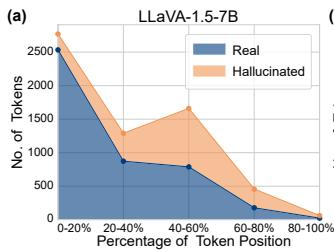

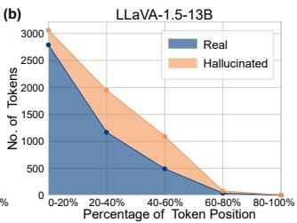

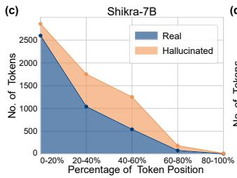

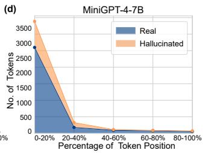

Figure 9. Real and hallucinated object token distributions by their position in description (%).  
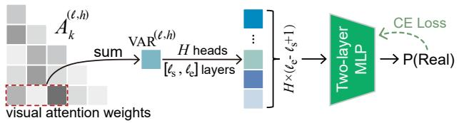  
Figure 10. Illustration of detecting hallucinated object tokens by training an MLP classifier on the concatenated VAR scores.

<table><tr><td>Hyperparameters</td><td>LLaVA-1.5-7B</td></tr><tr><td>Optimizer</td><td>Adam [22]</td></tr><tr><td>(β1, β2)</td><td>(0.9, 0.999)</td></tr><tr><td>Hidden size</td><td>{64, 128, 256, 512}</td></tr><tr><td>Learning rate</td><td>{1e-2, 1e-3, 1e-4}</td></tr><tr><td>No. of epochs</td><td>200</td></tr></table>

Table 7. Training hyperparameters of the two-layer MLP for hallucination detection on LLaVA-1.5-7B.

## C. Additional Results

## C.1. Case Study Results

In this subsection, we conduct additional experiments on LLaVA-1.5-13B, Shikra-7B, and MiniGPT-4-7B to examine whether other models also share similar characteristics with LLaVA-1.5-7B.

LLaVA-1.5-13B. Fig. 11 (a) and (b) show the VAR score distribution and the prediction contributions from the

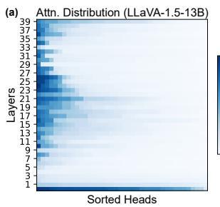

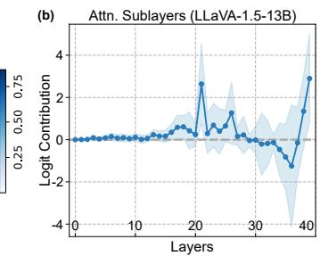  
Figure 11. (a) Distribution of visual attention ratio for real object tokens across heads and layers in LLaVA-1.5-13B, sorted rowwise by attention ratios. (b) The logit contribution of attention sublayers to real token prediction.

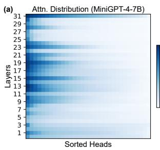

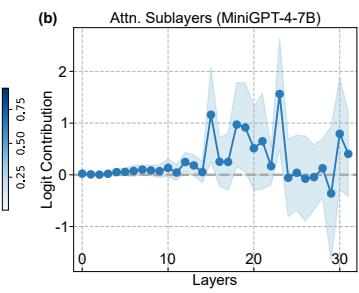  
Figure 12. (a) Distribution of visual attention ratio for real object tokens across heads and layers in MiniGPT-4-7B, sorted row-wise by attention ratios. (b) The logit contribution of attention sublayers to real token prediction.

MHSA sublayers, respectively. We find the same two patterns in the middle layers analogous to those found in LLaVA-1.5-7B as described in Sec. 3.3, suggesting the model scale generalization of our findings. Fig. 15 presents qualitative comparisons of hallucination detection between the $\mathrm { S V A R _ { 5 - 1 8 } }$ metric and the internal confidence method, demonstrating the superiority of our metric.

MiniGPT-4-7B. Fig. 12 (a) and (b) depict the VAR score distribution and the prediction contributions from the MHSA sublayers, respectively. Similar to LLaVA-1.5-7B, the two patterns in the middle layers where the model exhibits continuous higher visual attention can be observed. Notably, we can see that MiniGPT-4-7B does not exhibit the same high attention as LLaVA-1.5 at the 0-th layer. In our experiments, layers 3-14 are selected as the range of the visual information enrichment stage. Fig. 14 (b) reports the $\mathrm { S V A R _ { 3 - 1 4 } }$ value distribution across the two token types, demonstrating a similar trend to LLaVA-1.5-7B as described in Sec. 3.4. These results suggest the model generalization of our findings. The qualitative results of hallucination detection are presented in Fig. 16.

Shikra-7B. As shown in Fig. 13 (a), Shikra continuously exhibits extremely high VAR scores across layers. To clearly analyze the VAR distribution, a seventh-order polynomial is used to fit the summed VAR values over all heads of each layer (depicted by a red curve). Compared to other layers, we can see that the middle layers exhibit relatively higher VAR scores, aligning with our observation from LLaVA-1.5-7B. Combined with the prediction contributions from MHSA sublayers in Fig. 13 (b), we can also identify two distinct patterns in the middle layers. Like MiniGPT-4-7B, Shikra-7B exhibits low visual attention at the 0-th layer. In our experiments, layers 3-13 are selected as the range of the visual information enrichment stage. Fig. 14 (a) presents the $\mathrm { S V A R _ { 3 - 1 3 } }$ value distribution across the two token types, demonstrating a similar trend to other LVLMs. The comparison results of hallucination detection, displayed in Fig. 17, show that our simple $\mathrm { S V A R _ { 3 - 1 3 } }$ metric performs comparably to the more complex baseline that projects the hidden states of all image tokens at all layers into the vocabulary space. Compared to other LVLMs, the decreased performance of the SVAR metric on Shikra-7B may be attributed to the extremely high VAR scores across nearly all layers, potentially reducing the sensitivity of our metric to attention pattern differences.

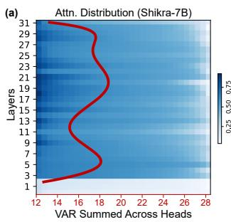

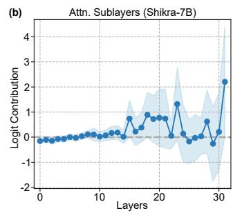  
Figure 13. (a) Distribution of visual attention ratio for real object tokens across heads and layers in Shikra-7B, sorted row-wise by attention ratios. Note that the red curve represents a seventh-order polynomial fit to the values of attention ratios summed over heads in each layer. (b) The logit contribution of attention sublayers to real token prediction.

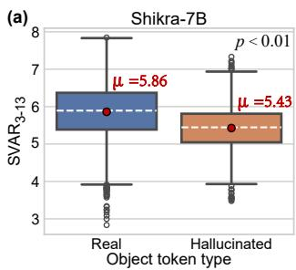

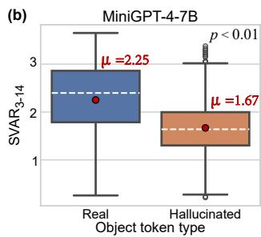  
Figure 14. $\operatorname { S V A R } _ { 3 - 1 3 }$ and $\mathrm { S V A R _ { 3 - 1 4 } }$ score distributions across object token types for Shikra-7B (a) and MiniGPT-4-7B (b), respectively.

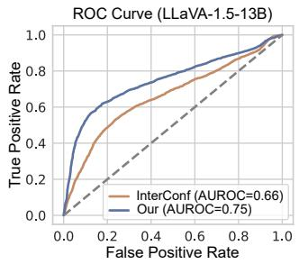

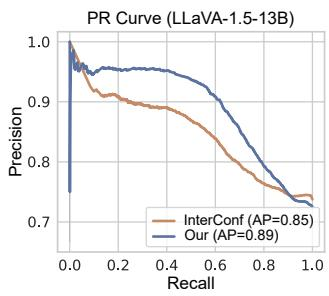  
Figure 15. Object hallucinations detection curves for LLaVA-1.5- 13B.

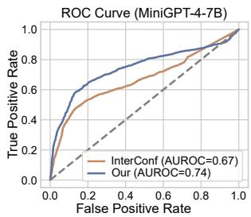

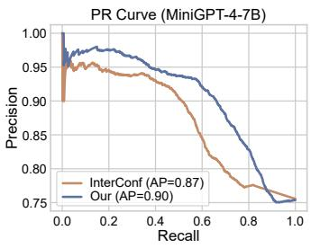  
Figure 16. Object hallucinations detection curves for MiniGPT-4- 7B.

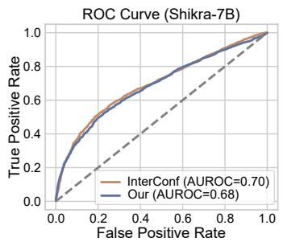

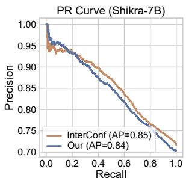  
Figure 17. Object hallucinations detection curves for Shikra-7B.

## C.2. Results of Statistical Tests

To assess the statistical significance of the SVAR score being higher for real object tokens than for hallucinated ones during visual information enrichment, we conduct a onetailed t-test for each LVLM. We present the results in Tab. 8 for LLaVA-1.5-7B, Tab. 9 for LLaVA-1.5-13B, Tab. 10 for Shikra-7B, and Tab. 11 for MiniGPT-4-7B. Across all models, the results consistently indicate that significantly higher attention weights are assigned to image tokens when generating real object tokens, compared to hallucinated ones.

## C.3. Numerical Results of α Sensitivity

Tab. 12 presents the sensitivity results of the balance factor α, used in our attention intervention method (Eq. (6)), on LLaVA-1.5-7B, LLaVA-1.5-13B, and MiniGPT-4-7B. In addition to modulating the trade-off between hallucination mitigation and description richness as discussed in Sec. 5, we find that LLaVA-1.5-7B and LLaVA-1.5-13B are more sensitive to changes in α compared to MiniGPT-4- 7B. A possible reason for this increased sensitivity may be that LLaVA-1.5 uses substantially more image tokens than MiniGPT-4 (576 versus 32), potentially magnifying the impact of the parameter α.

<table><tr><td>LLaVA-1.5-7B</td><td>Real</td><td>Hallucinated</td></tr><tr><td> $\mathrm { S V A R } _ { 5 - 1 8 }$  score</td><td>1.70</td><td>1.25</td></tr><tr><td>t-statistic</td><td></td><td>32.44</td></tr><tr><td>p-value</td><td></td><td>1.03E-213</td></tr><tr><td>df</td><td></td><td>6,237</td></tr></table>

Table 8. Results of one-tailed t-tests for LLaVA-1.5-7B. The null hypothesis is the mean ${ \mathrm { S V A R } } _ { 5 }$ score of real object tokens is less than or equal to the mean ${ \bf S V A R } _ { 5 - 1 8 }$ score of hallucinated ones.

<table><tr><td>LLaVA-1.5-13B</td><td>Real</td><td>Hallucinated</td></tr><tr><td> $\mathrm { S V A R } _ { 5 - 1 8 }$  score</td><td>1.50</td><td>1.06</td></tr><tr><td>t-statistic</td><td></td><td>32.24</td></tr><tr><td>p-value</td><td></td><td>3.25E-211</td></tr><tr><td>df</td><td></td><td>6,186</td></tr></table>

Table 9. Results of one-tailed t-tests for LLaVA-1.5-13B. The null hypothesis is the mean $\mathrm { S V A R } _ { 5 - 1 8 }$ score of real object tokens is less than or equal to the mean ${ \bf S V A R } _ { 5 - 1 8 }$ score of hallucinated ones.
<table><tr><td>Shikra-7B</td><td>Real</td><td>Hallucinated</td></tr><tr><td> $\mathrm { S V A R _ { 3 - 1 3 } }$  score</td><td>5.86</td><td>5.43</td></tr><tr><td>t-statistic</td><td></td><td>22.56</td></tr><tr><td>p-value</td><td></td><td>1.50E-108</td></tr><tr><td>df</td><td></td><td>6,055</td></tr></table>

Table 10. Results of one-tailed t-tests for Shikra-7B. The null hypothesis is the mean $\mathrm { S V A R } _ { 3 - 1 3 }$ score of real object tokens is less than or equal to the mean $\mathrm { S V A R } _ { 3 - 1 3 }$ score of hallucinated ones.

<table><tr><td>MiniGPT-4-7B</td><td>Real</td><td>Hallucinated</td></tr><tr><td> $\mathrm { S V A R _ { 3 - 1 4 } }$  score</td><td>2.25</td><td>1.67</td></tr><tr><td>t-statistic</td><td></td><td>22.06</td></tr><tr><td>p-value</td><td></td><td>4.21E-102</td></tr><tr><td>df</td><td></td><td>3,978</td></tr></table>

Table 11. Results of one-tailed t-tests for MiniGPT-4-7B. The null hypothesis is the mean $\mathrm { S V A R } _ { 3 - 1 4 }$ score of real object tokens is less than or equal to the mean $\mathrm { S V A R } _ { 3 - 1 4 }$ score of hallucinated ones.

## C.4. Attention Heads Behavior Visualization

We exhibit more visualization examples of LLaVA-1.5-7B in Figs. 18 and 19 to validate that the heads interact with

<table><tr><td rowspan="2">α</td><td colspan="3">LLaVA-1.5-7B</td><td colspan="3">LLaVA-1.5-13B</td><td colspan="3">MiniGPT-4-7B</td></tr><tr><td> $C _ { S } \downarrow$ </td><td> $C _ { I } \downarrow$ </td><td>F1↑</td><td> $C _ { S } \downarrow$ </td><td> $C _ { I } \downarrow$ </td><td>F1↑</td><td> $C _ { S } \downarrow$ </td><td>CI↓</td><td>F1↑</td></tr><tr><td>Greedy</td><td>53.0</td><td>15.6</td><td>76.7</td><td>49.8</td><td>14.6</td><td>78.2</td><td>31.8</td><td>12.0</td><td>71.1</td></tr><tr><td>0.3</td><td>41.8</td><td>12.2</td><td>77.9</td><td>44.4</td><td>12.5</td><td>78.1</td><td>28.0</td><td>10.0</td><td>70.5</td></tr><tr><td>0.4</td><td>41.6</td><td>11.5</td><td>78.1</td><td>44.6</td><td>13.2</td><td>77.5</td><td>27.2</td><td>10.8</td><td>71.2</td></tr><tr><td>0.5</td><td>25.0</td><td>6.7</td><td>76.1</td><td>25.8</td><td>8.8</td><td>77.3</td><td>22.4</td><td>8.6</td><td>70.8</td></tr><tr><td>0.6</td><td>1.0</td><td>0.9</td><td>49.3</td><td>6.4</td><td>3.3</td><td>57.7</td><td>20.6</td><td>8.6</td><td>69.5</td></tr><tr><td>0.7</td><td>1.6</td><td>2.0</td><td>36.8</td><td>2.4</td><td>26.3</td><td>40.0</td><td>14.6</td><td>5.9</td><td>67.4</td></tr></table>

Table 12. Numerical results of balance factor α sensitivity.
<table><tr><td>LLaVA-1.5-7B</td><td>Greedy</td><td>Beam</td><td>OPERA</td><td>VCD†</td><td>PAI†</td><td>Ours</td></tr><tr><td>CHAIR↓</td><td>7.7</td><td>9.1</td><td>7.3</td><td>8.6</td><td>4.9</td><td>4.3</td></tr><tr><td>Hal↓</td><td>35.4</td><td>39.8</td><td>31.5</td><td>39.5</td><td>24.4</td><td>20.2</td></tr><tr><td>Cog↓</td><td>4.3</td><td>4.8</td><td>2.9</td><td>4.5</td><td>1.6</td><td>1.2</td></tr></table>

Table 13. AMBER results on LLaVA-1.5-7B with max new token set to 512. † denotes using the greedy decoding strategy.

inconsistent objects in the image during visual information enrichment when generating hallucinated object tokens.

## C.5. Comparison Results on AMBER Benchmark

We further evaluate our approach on AMBER [41] benchmark, which contains 1,004 images for the generative task. The results presented in Tab. 13 demonstrate its superior performance.

## C.6. Some Intuition Behind Layer Division

The layers of LLaVA-1.5-7B are divided into four ranges according to the patterns identified from the results of VAR score (Fig. 2 (a)) and logit lens (Fig. 2 (b) and Fig. 3). We find Range 1 (layer 0-4): low-level image processing, VAR attention pattern differs in different models; Range 2 (layer 5-18): visual information enrichment, accumulates the visual information exhibiting high VAR scores and low logit contribution; Range 3 (layer 19-26): semantic refinement, interacts semantic information of image tokens with high VAR scores and reasons object token prediction with high logit contribution; Range 4 (layer 27-31): grammar concern, guarantees the coherence and correctness of response with low VAR scores, in which the model tends to interpret image tokens as punctuation marks or conjunctions (Fig. 3). These patterns can be generalized to divide other LVLMs similarly. It is worth noting that the first and last divisions are not fixed at 5 layers but vary with models.

## C.7. Qualitative Results of Hallucination Mitigation

We provide sample results from our hallucination mitigation method as described in Sec. 4.1, which corrects the attention distribution over image tokens, in Fig. 20, Fig. 21 and Fig. 22 for LLaVA-1.5-7B, MiniGPT-4-7B, and Shikra-7B, respectively.

Image  

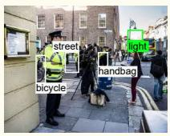

## User: Please help me describe the image in detail.

The image depicts a busy city street with a crowd of people walking around. Among the crowd, a woman is standing on the sidewalk, holding a cell phone and looking at it. There are severalother people in the scene, some of them carrying handbags and backpacks. A police officer is standing on the sidewalk, observing the crowd and ensuring public safety. A bus is visible in the background, adding to the urban atmosphere. There are also a few bicycles parked or being ridden by people in the scene. In addition to the people and objects, there are traffic lights present in the image, indicating that the street is well-regulated for vehicle and pedestrian traffic.

## LLaVA-1.5-7B (Greedy):

Image  
Layer 12, Head 4  
  
Layer 14, Head 9  
Layer 15, Head 14

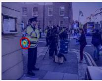

  
Layer 14, Head 24

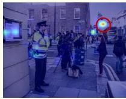

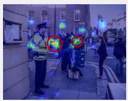

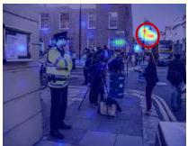

  
The image features a bed with a laptop computer sitting on top of it. The laptop is open and displaying a video, likely a TV show or movie. A person is sitting on the bed, watching the content on the laptop screen. In the room, there are a few other items, such as a book located near the laptop and a cell phone placed on the bed. Additionally, there is a cup situated on the bed, possibly for enjoying a beverage while watching the content.

## User: Please help me describe the image in detail.

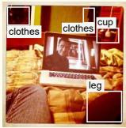

## LLaVA-1.5-7B (Greedy):

Layer 14, Head 4  
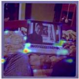

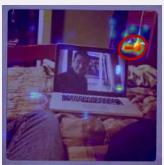

Layer 15, Head 5  
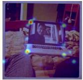  
Layer 15, Head 10

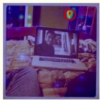

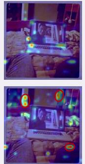

Layer 16, Head 4  

## Image

## User: Please help me describe the image in detail.

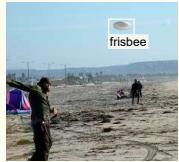

The image captures a lively scene at a beach, where a man is throwing a frisbee. The frisbee is in the air, and the man is in the process of throwing it. There are several other people in the scene, some of them standing and others sitting on the sand. In the background, there are a few cars parked near the beach, and a truck can be seen further away. The beach setting and the presence of people enjoying their time create a relaxed and fun atmosphere.

## LLaVA-1.5-7B (Greedy):

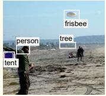

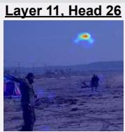

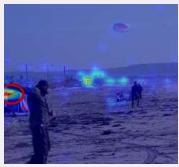

Layer 16, Head 6  
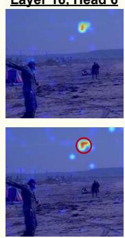  
Figure 18. Attention heads behavior in LLaVA-1.5-7B.

Image  

## User: Please help me describe the image in detail.

## LLaVA-1.5-7B (Greedy):

The image features a man sitting at a dining table with a baby in his arms. The man is holding a cell phone, possibly showing the baby something on the screen. The baby is also holding a cell phone, which is placed in front of them. There are two laptops on the table, one on the left side and another on the right side. A book is also present on the table, located near the right side of the scene. A chair can be seen in the background, positioned behind the man and the baby.

  
Layer 14, Head 4  
Layer 14, Head 29  
Layer 17, Head 2  
Layer 17, Head 9

## User: Please help me describe the image in detail.

## LLaVA-1.5-7B (Greedy):

The image features a young man wearing a bandana around his head, holding a hot dog in his hand. He is standing on a boardwalk, enjoying his meal. There are several other people in the background, some of them carrying backpacks. In addition to the main hot dog, there are two more hot dogs visible in the scene, one near the center and another towards the right side. A person can be seen holding a plate with a hot dog on it, while another person is holding a plate with a hot dog and a bun.

Layer 13, Head 2  
Layer 13, Head 4  
Layer 13, Head 22  
Layer 17, Head 10  

Image  

## User: Please help me describe the image in detail.

## LLaVA-1.5-7B (Greedy):

The image features a young boy standing in a living room, playing a video game on a Nintendo Wii console. He is holding a Wii remote in his hand, fully engaged in the game. The television screen is located on the right side of the room, displaying the game he is playing. The living room is furnished with a couch situated in the background, and a chair is placed nearby. There are also a few books scattered around the room, possibly indicating a reading or leisure area. A backpack can be seen on the floor, possibly belonging to the boy or someone else in the household.

  
Figure 19. Attention heads behavior in LLaVA-1.5-7B.

Greedy: The image features two women sitting at a dining table, engaged in a conversation. They are both wearing glasses and appear to be discussing something important. The table is filled with various items, including a book, a cell phone and a notebook. There are several chairs around the table, with one on the left side and another on the right side. A cup can be seen placed on the table, and a remote control is also present. The room has a cozy atmosphere, with a couch in the background and a TV mounted on the wall.

Ours: In the image, two women are sitting at a table, with one woman looking at a book and the other woman looking at her cell phone. The table is covered with a red tablecloth, and there are several books on the table. The women are surrounded by a chair, a book, and a cell phone. The table is also equipped with a laptop and a notebook.

Greedy: The image depicts a spacious and wellfurnished living room with a large couch and a television. The couch is positioned in the center of the room, with a chair placed nearby. The television is mounted on the wall, and there is a remote control placed on the couch. The living room is adorned with several decorative elements including a potted plant, a vase, and a clock. The room also features a dining table with chairs, and a doorway leading to another room. The overall atmosphere of the living room is inviting and comfortable.

Ours: The image showcases a spacious living room with a large couch and a television. The couch is situated in the center of the room. and the television is placed on the left side of the room. The living room also features a dining table and chairs, with one chair visible in the scene. The room is well-decorated with a potted plant and a vase, adding a touch of greenery to the space. The room also has a large window, allowing natural light to fill the room.

Greedy: The image depicts a spacious living room with a variety of furniture and decor. The room features a large couch situated in the middle, with a chair placed nearby A dining table is also present in the room, accompaniec by a few chairs. The living room is adorned with a fireplace, which serves as a focal point in the space. A potted plant is placed near the fireplace, adding a touch of greenery to the room. In addition to the main furniture, there are two people in the room. one standing near the left side and the other closer to the right side. A car can be seen in the background, possibly indicating that the living room is located in an apartment or a house with a garage

Ours: The living room is decorated with a variety of furniture and artwork. There is a couch, a chair, and a table in the room. The couch is orange, and the chair is green. The room also features a fireplace, a potted plant and a painting on the wall. The room is decorated with a variety of furniture and artwork, creating a cozy and inviting atmosphere.

Greedy: The image captures a snowboarder skillfully riding down a snow-covered ramp, performing a trick as they slide down the slope. The snowboarder is wearing a blue jacket and is in the middle of the action. There are several other people in the scene, some of them standing near the ramp, while others are scattered around the area. A bench can be seen in the background, and a handbag is placed on the ground near one of the people. The overall atmosphere of the scene is lively and energetic, with people enjoying the snowboarding activities.

Ours: The image shows a snowboarder in a blue jacket riding a snowboard down a ramp. The snowboarder is wearing a blue jacket and is performing a trick on the ramp. There are several people watching the snowboarder, including a man in a black jacket and a woman in a red jacket. The snowboarder is in the middle of the ramp, and the spectators are spread out around the scene, with some standing closer to the ramp and others further away.

Greedy: The image features a large brown and white dog sitting on a table, with its mouth open and tongue hanging out. The dog appears to be enjoying its time and possibly panting. The table is located in a room with a window, providing natural light to the scene. In the background, there are two people present, one standing closer to the left side of the image and the other person standing further back on the right side. Additionally, there is a chair placed near the right side of the room

Ours: The dog is a large, brown and white dog with a black nose. It is standing in front of a brown box, and its mouth is open. The dog appears to be a large breed, possibly a Saint Bernard. The dog is looking at the camera, possibly a picture of a dog.

Greedy: The image features a woman sitting in front of a laptop computer, which is placed on a desk. She is focused on the screen, likely working or browsing the internet. The woman is wearing a black shirt and has her hair pulled back in a ponytail. In the background, there is a couch and a chair, providing a comfortable seating area for the woman. Additionally, there are two bottles placed on the desk, one near the laptop and the other further away. A cell phone can also be seen on the desk, possibly for communication or reference purposes.

Ours: The image shows a woman sitting in front of a laptop computer. She is wearing a black shirt and has her hair pulled back in a ponytail. The laptop screen is on, and she is looking at it. The laptop is white and is placed on a table.

Figure 20. Qualitative results of hallucination mitigation on LLaVA-1.5-7B. The real and hallucinated object words are marked in blue and red, respectively. Our prompt is “Please help me describe the image in detail.”.

Greedy: The image shows a display of various types of clothing items, including shirts, ties, and jackets, all hung on a rack or displayed on a table The items are arranged in a random order, with some items visible on the table and others hanging on the rack. The overall appearance of the image is cluttered and disorganized, with a lot of different items visible in the frame.

Ours: The image shows a display of various types of clothing items, including shirts. ties. and other accessories, all displayed on a rack or hanger. The items are arranged in a neat and organized manner, with each item clearly visible and labeled with a tag or label.

Greedy: The image shows a dog standing in front of an open refrigerator. The refrigerator has a white interior and a door that is partially open. The dog is looking inside the refrigerator and appears to be sniffing around. There are several bags of fruit and vegetables on the floor in front of the refrigerator. The bags are labeled with various types of produce, including apples bananas, and carrots. There are also some containers of yogurt and milk in the refrigerator. The overall scene is one of a dog exploring the contents of a refrigerator

Ours: This image shows a dog standing in front of an open refrigerator with various fruits and vegetables inside. The dog's head is peeking out of the refrigerator door, and its body is visible behind it. The refrigerator has a white interior and a metal handle on the door. The floor is tiled and there is a light switch on the wall.

Greedy: The image shows a young girl sitting at a wooden table with a pizza dough on it. She is wearing a pink shirt and has curly brown hair. The pizza dough is topped with various ingredients such as pepperoni, mushrooms, and onions. There is a wooden spoon and knife next to the pizza dough. The background is a wooden wall with a few hooks on it.

Ours: The image shows a young girl sitting at a wooden table with a pizza on it. The pizza has various toppings on it, including pepperoni, mushrooms, and onions. The girl is wearing a pink shirt and has curly brown hair.

Greedy: The image shows two men standing in a room with large windows. One man is wearing a white shirt and black tie, while the other man is wearing a black suit and white shirt. The man in the black suit is adjusting the collar of the shirt of the man in the white shirt. The room has a wooden floor and a large wooden table in the center. There are also some chairs and a couch in the room. The walls are painted a light yellow color and have large windows with green curtains. The room appears to be a formal setting, such as a wedding or a business meeting.

Ours: The image shows two men standing in a room with large windows and a wooden floor. One man is wearing a white shirt and black tie, while the other man is wearing a black suit and white shirt The man on the left is adjusting the man's tie, while the man on the right looks on. The room has large windows and a wooden floor.

Greedy: The image shows a woman lying on a bed with her head resting on her hand. She is wearing a white shirt and has long, dark hair. The background is a light-colored wall with a striped pattern. There is a small table next to the bed with a vase of flowers on it. The woman's eyes are closed and she looks peaceful and relaxed.

Ours: The image shows a woman lying on a bed with her head resting on her hand. She is wearing a white shirt and has long, dark hair. The background is a white wall with a striped pattern.

Greedy: The image shows a large clock tower with a large clock face on the front. The clock tower is made of brown stone and has a pointed roof There are several gears and cogs visible on the clock face. In the background, there is a large ferris wheel with several cars on it. The ferris wheel is also made of metal and has a blue and white color scheme. There are several other buildings in the background, including a church and a tall building with many windows

Ours: The image shows a large clock tower with a large clock face on the front of it. The clock face is brown and has black numbers on it. The clock tower is made of stone and has a pointed roof There are several other buildings in the background, including a large ferris wheel.

Figure 21. Qualitative results of hallucination mitigation on MiniGPT-4-7B. The real and hallucinated object words are marked in blue and red, respectively. Our prompt is “Please help me describe the image in detail.”.

Greedy: The image features a fire hydrant that has been painted in a vibrant pattern, including a mix of colors such as orange, green, and white. The fire hydrant is located on a brick sidewalk, which appears to be a part of a street. There are two people in the scene, one standing closer to the fire hydrant while the other is further away. The person standing near the hydrant is carrying a handbag. Additionally, there is a car parked on the street, situated in the background

Ours: The image features a fire hydrant that has been painted in a bright, colorful pattern. The hydrant is located on a brick sidewalk, with people walking nearby. There are two people walking in the background, likely enjoying the view of the colorful fire hydrant. The fire hydrant is connected to a water hose that is positioned close to the right side of the image.

Greedy: The image features two young women sitting together in an outdoor setting, each talking on their cell phones. One woman is on her phone, while the other is using a cell phone that is not visible in the scene. They seem to be engaged in separate conversations or enjoying their time together. Additionally, there are a few other people in the scene, but they are not the main focus of the image. A chair can be seen in the background, and it appears that the women are seated on it while they chat on their phones.

Ours: The image shows two young women sitting in a park, each holding a cell phone to their ears. One of them is talking on her phone while the other is holding a phone. One of them is making a funny face as they are engaged in conversation. In the scene, there is an older woman in the background who is not visible. The young women are sitting together, laughing and talking on their cell phones The image focuses on the interaction between the two girls, each with their own cell phone.

Greedy: The image showcases a young boy wearing a red shirt and helmet, skateboarding on a ramp near the ocean. He is in the middle of performing a skateboard trick, possibly jumping up in the air. In the background, there are several cars and a bus parked close to the ramp, possibly belonging to the visitors or spectators of the skate park. The ocean can be seen beyond the ramp, creating a picturesque setting for the skateboarding activities

Ours: The image showcases a young boy riding a skateboard and jumping up in the air while wearing a helmet at a skate park or a ramp. The boy is wearing a red shirt and is fully geared up with protective gear, indicating that he might be practicing skateboarding tricks. In the background, there is a beach visible, adding a relaxing and enjoyable atmosphere to the scene. The young boy is likely having fun while practicing his skateboarding skills on a sunny day.

Greedy: The scene depicts a busy city intersection with a red traffic light near a large building. Several people are walking on the street, some carrying handbags. There are five pedestrians in total, with some walking closer to the traffic light while others are further away. Two cars are visible in the scene, one positioned near the traffic light and another one closer to the right side of the image. A bus can also be seen in the background, likely providing public transportation for people in the area. A streetlight is present in the scene, illuminating the area for safe navigation during nighttime or low-light conditions. Additionally, a bicycle is parked near the traffic light, hinting at the various modes of transportation used in the city.

Ours: The scene features a city street with a red traffic light showing a car stopped at a street corner. There are several people walking and standing near the traffic light, some of them are waiting to cross the street. The traffic light is located at an intersection in a city setting. In the image, there are multiple traffic lights placed at different positions along the road. One of the traffic lights is red, while the other traffic lights are placed at various locations along the street. The pedestrians are waiting to cross the street, while the car is stopped at the intersection.

Greedy: The image features a modern train station with a sleek-looking train positioned on the tracks. The train is surrounded by several benches, with four chairs located in front of it. providing seating for passengers. There are also three other benches situated in various parts of the station. The station is bustling with activity, as a group of people can be seen standing and walking around the area. Some people are close to the train, while others are further away, either waiting for the train or simply enjoying their time at the station. Overall, the scene captures the lively atmosphere of a busy train station.

Ours: The image showcases a modern train station with a sleek-looking black and vellow train sitting in the background. The train is parked on the tracks, and it appears to be stationary inside the building. The train occupies a significant portion of the scene, taking up a majority of the image.

Greedy: The image features a large computer monitor sitting on a wooden desk, with a keyboard placed in front of it. The monitor displays a black box, which seems to be a home screen for a computer. There is also a white mouse located on the right side of the keyboard. The desk is well-organized, and a book can be seen on the left side of the keyboard. Additionally, there are two cups placed on the desk, one near the center and another towards the right side. The scene suggests a workspace with a computer setup for daily use.

Ours: The image features a large computer monitor displaying a wide variety of items on the screen. There is a keyboard on the desk in front of the monitor, which indicates that the user can type and navigate through the computer. The monitor takes up most of the space on the desk, while the keyboard occupies a significant portion of the desk area

Figure 22. Qualitative results of hallucination mitigation on Shikra-7B. The real and hallucinated object words are marked in blue and red, respectively. Our prompt is “Please help me describe the image in detail.”.