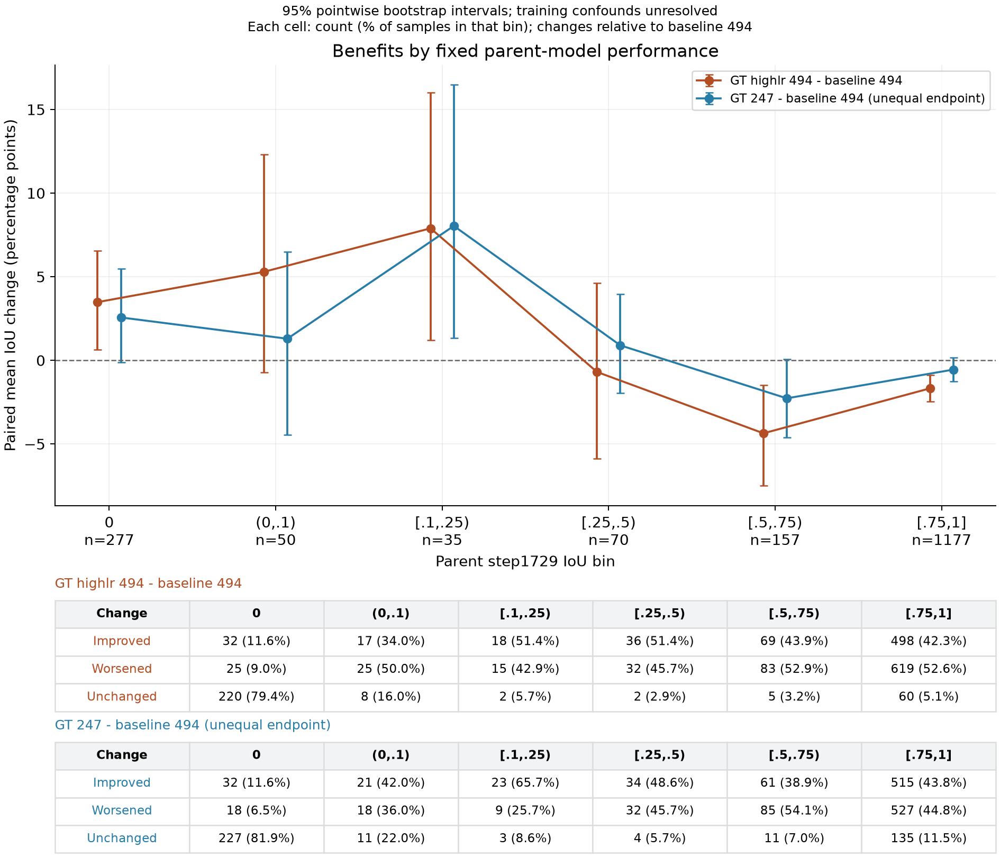

# E-009：GT align 的低性能样本收益曲线

日期：2026-09-07。性质：**[UNVERIFIED] 探索性离线诊断；不是 validated Claim，也不是新增训练 Run。** 本目录不修改审批、Claim、Run 授权或其它治理状态。

已有预测支持一个待确认的方向：GT-mask 分支的收益集中于部分父模型低分样本，同时伴随中高分样本损失。当前比较包含训练配置混杂，不能归因为 GT align 的独立因果作用。

2026-09-08 绘图更新：按用户要求，仅绘制原四联图左上角的父模型分箱增益图。曲线名、标题、坐标轴和分箱标签集中在 `analyze.py` 顶部的 `CURVE_LABELS`、`PLOT_TITLE`、`X_LABEL`、`Y_LABEL`、`PLOT_NOTE`、`BIN_LABELS`。修改文字后可直接重画，无需原始预测或重新计算 bootstrap：

```bash
PYTHONPATH=/tmp/e009_plot_deps MPLCONFIGDIR=/tmp/e009_mpl_config python3 shell/06_experiments/E-009/diagnostics/gt_align_curves_20260907/analyze.py --plot-only
```



2026-09-08 数量与比例更新：纵轴仍为组内平均 IoU 差值 ×100，即百分点，**不是发生变化的样本比例**。例如 +5 表示组内平均 IoU 提高 0.05。图下增加两种方法各自的提升／下降／不变表，每格写为 `数量（组内比例）`，分母是横轴该分组的全部样本数。相对 baseline494，IoU 差值 >1e-12 为提升，<−1e-12 为下降，其余为不变；这只是数值变化分类，不表示跨过某个成功阈值或具有统计显著性。三类计数相加等于该组 n；显示比例四舍五入至一位小数，可能不恰好合计 100%。计数保存在 `parent_bins.csv` 的 `wins/losses/ties` 字段中，`--plot-only` 可以直接重画。表格文字可在脚本顶部 `COUNT_NOTE`、`CHANGE_LABELS` 修改。

## 数据与比较口径

- 四组均为用户明确指定 branches 内的 1766 条自然生成预测：父模型 step1729、baseline 续训 step494、GT-mask step247、highlr GT-mask step494。目录名不代替实际 checkpoint 身份；具体来源与原始预测 SHA-256 见 `summary.json` 的 `provenance`。
- 主比较：highlr GT-mask step494 − baseline 续训 step494。GT-mask step247 作为不同训练终点的敏感性比较，不能视为等预算复现。
- 分组统一使用父模型 step1729 的 IoU，避免用某一个被比较分支的偶然低分单独定义困难样本。父模型分数仍有噪声，单次输出不能等同于稳定难度。
- “低性能”暂定义为父模型 IoU<0.5；这是事后诊断定义。同步显示多个固定分箱和累计阈值，不从图上挑最优阈值作为确认性结果。
- 4000 次配对 bootstrap，seed=20260907，按 dataset 分层并按 `(dataset, sequence)` 聚类抽样；本批 1766 个不同 sequence 各有一条样本。区间为逐点 95% 百分位区间，不是同时置信带，也不包含训练 seed 不确定性。
- 成功率严格定义为样本 `IoU >= threshold` 的比例，不是身份识别 recall。分组和 bootstrap 不使用新的模型 forward。

## 主要数值

| 固定父模型分组 | n | baseline mIoU | highlr GT-mask mIoU | 配对差值及逐点 95% 区间，百分点 |
|---|---:|---:|---:|---:|
| IoU<0.5 | 432 | 14.04% | 17.42% | +3.37 [+1.14, +5.67] |
| IoU≥0.75 | 1177 | 90.46% | 88.78% | −1.67 [−2.47, −0.88] |
| 全部 | 1766 | 69.44% | 68.76% | −0.68 [−1.51, +0.16] |

低性能组内，103 条提升、97 条下降、232 条不变；配对差值中位数为 0。该组中正向增益最大的 22 条（约占组内 5%）贡献了全部正向增益的 66.9%，这是对正向总量的占比，不是净增益占比。删除绝对变化最大的 5% 样本后，平均差值仍为 +1.11 个百分点；这只是事后敏感性统计，不能用来筛除正式评估中的样本。

在固定低性能组中，成功率@0.5 救回 41 条、丢失 17 条，净增 24 条，即 +5.56 个百分点，逐点区间 [+2.21, +8.91]。全体样本则救回 52 条、丢失 63 条，净减少 11 条。

分数据集的低性能组：LaSOT n=161，平均差值 +4.81 [+1.30, +8.62] 个百分点；TAO n=253，+2.80 [−0.02, +5.88]；GOT10k n=18，−1.30 [−16.41, +14.74]。不能声称跨数据集一致改善。

GT-mask step247 相对 baseline step494，在同一低性能组的平均差值为 +2.59 [+0.67, +4.65] 个百分点。方向相同，但训练终点不同，不能据此排除预算或学习率混杂。

## 原四组诊断的解释（当前仅绘制第 1 项）

1. **A：固定父模型分箱。** 展示每个区间的样本数、平均变化和不确定性。收益不是随困难程度简单单调变化：highlr 分支在父模型 [0.25,0.5) 的均值为负且区间跨 0；不能把 IoU<0.5 组的平均收益推广到组内每个区间。
2. **B：累计低分集合。** 固定父模型分数排序，以 IoU<c 的全部样本为集合，不拆开同分样本。随 cutoff 扩大，highlr 分支平均收益从低分集合中的正值逐渐降到全体的负值。图中最右端表示全体 IoU≤1。
3. **C：成功率阈值曲线之差。** 每个阈值同时考虑救回和丢失，全局多数阈值的点估计低于 0。经验成功率曲线在 [0,1] 上的精确积分就是 mIoU；某个阈值有提升不意味着积分提升。脚本对四组进行了精确积分校验。
4. **D：逐样本差值的经验累积分布。** 零处的大跳跃说明大量样本没有变化；低性能组右侧较长的尾部说明部分样本有较大的正向变化。应进一步识别这些样本的可解释特征，而不只报告均值。

## 下一步的确认实验建议（未执行）

1. 保留全部样本，固定父模型分组口径，在独立确认集上重测同样的曲线；不根据这批曲线的峰值挑阈值或筛选测试样本。若需要估计稳定难度，可使用独立基线重复预测或交叉拟合；这些重复结果不能混入当前一次预测结果。
2. 同一父 checkpoint、数据顺序、学习率、更新数，对比 CE-only 与 CE+GT-align；先保留 baseline/highlr 中学习率相同的严格配对，再以少量预定 align 权重画“低分收益—高分损失”曲线。至少多 seed 才能讨论训练稳定性。
3. 对救回／丢失样本按固定规则抽样、盲审框与目标实例，并统计中心误差、宽高误差、GT 覆盖率与框内重叠比例。判断收益来自目标实例选择还是边界修正，再决定是否分离 reference/query 监督。
4. 只有确认训练效应后，再对冻结 heads 做有匹配对照的干预检验。attention 与 IoU 同向变化只是相关诊断，不等于机制证据。若探索按难度调整训练权重，只能使用训练集信息；不能依赖推理时不可获得的 query GT 决定路由。

## 检查、证据边界与复现

检查通过：四组唯一键数量均为 1766；样本身份和 GT 字符串完全一致；全部 parsed；IoU 有限且在 [0,1]；分箱互斥且覆盖全部样本；分组贡献之和等于全体平均差；四组经验成功曲线精确积分等于各自 mIoU。图已完成视觉检查。

未核验：原图哈希、预处理实现的完全一致性、训练参数的严格匹配、split 独立性和多 seed 稳定性。原预测 IoU 在本次分析中作为已保存分数使用；上一轮主比较正面积框的几何重算与原 IoU 一致，但本次未重新计算四组全部框的 IoU。

当前 E-009 canonical objective 仍为 SFT 可行性，正式 `metric_definitions` 为空；本目录不补写正式主指标。相关 Solid ID：`E009-R-007-head-stability-last5`，仅作为已知 head 选择的背景，不作为本次曲线的因果证据。上一轮只读核验发现其 summary 为 completed、五次筛选 comparability 通过，但 suite manifest 为 failed/FileExistsError、completed 数为 3；该状态不一致仍未解决，也未修改其 Solid 标签。

复现脚本：`analyze.py`；完整结果：`summary.json`；原始曲线数据：本目录五个 CSV；图：PNG、SVG、PDF。输入预测当前位于 `/tmp/e009_gt_align_curves_20260907/`，可能随临时目录清理失效；可按 `summary.json` 的四个来源重新取回并校验哈希。

本次 Python 环境使用临时安装的 NumPy 2.5.3、Matplotlib 3.11.1。复现命令：

```bash
PYTHONPATH=/tmp/e009_plot_deps MPLCONFIGDIR=/tmp/e009_mpl_config OPENBLAS_NUM_THREADS=1 python3 shell/06_experiments/E-009/diagnostics/gt_align_curves_20260907/analyze.py --input /tmp/e009_gt_align_curves_20260907
```

未运行新训练、推理或 head 干预；未写入审批、Claim、Run 授权或其他治理状态。
