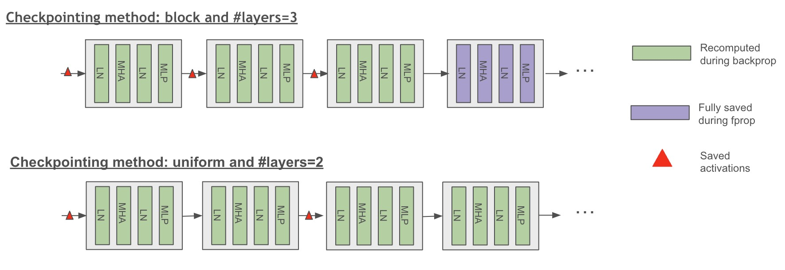
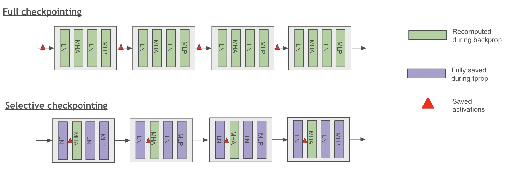

# Activation Recomputation

The input activations of network layers are stored in device memory and are used
to compute gradients during back-propagation. When training a model with long
sequences, large micro-batches, or heavy MoE memory pressure, these activations
can quickly saturate device memory. Checkpointing some activations and
recomputing the rest is a common way to trade extra compute for lower memory
use.

Activation recomputation in Megatron Bridge is configured through the model
provider's recomputation parameters, which are based on Megatron Core's
`TransformerConfig`.

## Quick Guidance

As a rule of thumb:

- start with **selective recomputation** before using full recomputation
- use **full recomputation** only when selective recomputation still does not fit
- choose selective modules from the model and measured peak: `core_attn` is a
  common standard-attention candidate, MLA often benefits from `mla_up_proj`,
  and grouped MoE often starts with `moe_act` or `layernorm` plus `moe_act`
- with TE fused or Flash Attention, compare `core_attn` against an empty
  selective module list because the backend already rematerializes attention
  internals
- revisit recomputation after enabling CUDA graphs, because TE-scoped graphs and
  full recomputation are not always compatible

## Transformer Layer Recomputation

Megatron Bridge supports transformer layer recomputation, which checkpoints the
input of each transformer layer and recomputes the activations for the
remaining layers. This technique significantly reduces activation memory usage.
However, it also adds a large compute cost because the whole layer forward is
executed again during backward.

Megatron Bridge also supports partial transformer layer recomputation, which is
useful when recomputing only some layers is enough to make the model fit.

### Configuration

Transformer layer recomputation is configured through the model provider's recomputation parameters:

```python
from megatron.bridge.models import GPTModelProvider

# Full recomputation - recompute all layers
model_config = GPTModelProvider(
    recompute_granularity="full",  # Enable full layer recomputation
    recompute_method="uniform",    # Uniform distribution across layers
    recompute_num_layers=4,        # Number of layers per recomputation block
    # ... other model parameters
)
```

### Recomputation Methods

#### Block Method
Recomputes a specific number of transformer layers per pipeline stage:

```python
model_config = GPTModelProvider(
    recompute_granularity="full",
    recompute_method="block",      # Block-wise recomputation
    recompute_num_layers=4,        # Recompute 4 layers per pipeline stage
)
```

#### Uniform Method
Uniformly divides the total number of transformer layers and recomputes input activations for each divided chunk:

```python
model_config = GPTModelProvider(
    recompute_granularity="full",
    recompute_method="uniform",    # Uniform distribution
    recompute_num_layers=8,        # Number of layers per recomputation block
)
```

### Pipeline Parallelism Considerations

When training with pipeline parallelism:
- `recompute_num_layers` indicates the layers per pipeline stage
- When using virtual pipelining, `recompute_num_layers` specifies the number of layers per virtual pipeline stage
- The framework automatically handles recomputation coordination across pipeline stages


*Figure 1: Scheme of uniform and block checkpointing method (full checkpointing granularity)*

## Self-attention Recomputation

Megatron Bridge supports selective self-attention recomputation that checkpoints
the core-attention boundary and recomputes it during backward. This can be a
cost-efficient choice for standard attention, but it is not the universal first
boundary for MLA, MoE, or fused-attention workloads.

The intermediate layers of the self-attention block account for a large share
of activation memory because softmax, dropout, and QKV dot-product attention
scale with sequence length squared. Their recomputation cost is often lower than
recomputing the larger projection-heavy parts of the layer.


*Figure 2: Scheme of full and selective checkpointing granularity*

### Configuration

Self-attention recomputation is enabled using selective granularity:

```python
from megatron.bridge.models import GPTModelProvider

model_config = GPTModelProvider(
    recompute_granularity="selective",  # Enable selective recomputation
    recompute_modules=["core_attn"],    # Common standard-attention candidate and MCore default
    # ... other model parameters
)
```

### Recomputation Modules

The pinned Megatron Core accepts these selective labels. Do not combine them
blindly: some are architecture-specific and some checkpoint overlapping
regions.

| Label | Boundary and typical use |
|---|---|
| `core_attn` | Core attention; a common standard-attention candidate that can replay context-parallel communication |
| `mla_up_proj` | Expanded MLA Q/KV projections and RoPE; often the first MLA candidate |
| `moe_act` | Grouped-expert activation output without replaying dispatch or expert GEMMs |
| `layernorm` | Input and pre-MLP normalization outputs, often paired with a MoE or MLA boundary |
| `mlp` | Whole dense MLP; broader replay and no effect on pure-MoE layers |
| `moe` | Whole MoE forward, including routing, expert compute, and communication |
| `shared_experts` | Non-overlapped shared-expert MLP |
| `gdn_norm_out` | GatedDeltaNet output norm and HP-to-CP communication |

An empty list is valid under selective granularity and is useful as a matched
no-recompute control.

### Flash Attention Integration

Flash Attention through Transformer Engine already recovers memory by
rematerializing attention internals. That does not automatically make
`recompute_modules=["core_attn"]` the right explicit setting. Compare it with an
empty selective module list; MLA up projections, MoE activations, normalization,
or another boundary may set the actual peak.

## Advanced Recomputation Configuration

### Distributed Activation Checkpointing

For models using model parallelism, you can distribute saved activations across the model parallel group:

```python
model_config = GPTModelProvider(
    recompute_granularity="selective",
    distribute_saved_activations=True,  # Distribute across model parallel group
    # Note: Cannot be used with sequence_parallel=True
)
```

### Memory vs Computation Trade-offs

Different recomputation strategies offer different memory-computation trade-offs:

- **Selective recomputation**: Usually the best first choice. Targets the most
  memory-expensive operations while keeping the compute penalty relatively low.
- **Full recomputation**: Strongest memory reduction, but also the highest
  compute overhead.
- **No recomputation**: Best for throughput when the model already fits.

### MoE-Specific Recomputation

For Mixture of Experts models, specialized recomputation options are available:

```python
model_config = GPTModelProvider(
    # MoE configuration
    num_moe_experts=8,
    expert_model_parallel_size=2,
    moe_grouped_gemm=True,
    
    # MoE recomputation
    recompute_granularity="selective",
    recompute_modules=["moe_act", "layernorm"],  # Narrow MoE-side candidates
)
```

`moe_act` requires grouped-GEMM experts. Whole-`moe` recompute is a broader
alternative that replays routing, dispatch/combine communication, expert
compute, and shared-expert work; it is incompatible with expert-parallel
overlap. `shared_experts` recompute is likewise incompatible with shared-expert
overlap. Prefer the narrow boundary that satisfies the memory target.

## Feature Interactions

- Full recomputation with CUDA graphs requires
  `cuda_graph_impl="full_iteration"` in the pinned Megatron Core. Otherwise use
  selective recomputation or disable CUDA graphs.
- A selective checkpoint boundary must lie wholly inside or wholly outside its
  CUDA-graph scope.
- MoE communication overlap paths often require recomputation settings that are
  more selective than "full."
- At long context, recomputing SDPA-heavy attention internals can cost more than
  recomputing smaller supporting modules.
- Advancing from a forward OOM to a gradient-synchronization or optimizer OOM
  is useful diagnosis, but not a pass. Validate through optimizer-state
  initialization and multiple steady-state iterations.

## Related Docs

- [docs/training/cuda-graphs.md](cuda-graphs.md)
- [docs/training/moe-optimization.md](moe-optimization.md)
- [skills/nemo-mbridge-perf-activation-recompute/SKILL.md](../skills/nemo-mbridge-perf-activation-recompute/SKILL.md) — architecture-specific module selection, compatibility, and measurement guidance
- [skills/nemo-mbridge-perf-memory-tuning/SKILL.md](../skills/nemo-mbridge-perf-memory-tuning/SKILL.md) — expandable segments, parallelism resizing, and other memory reduction strategies
